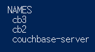
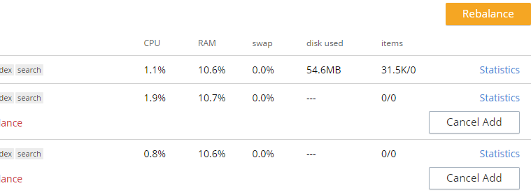
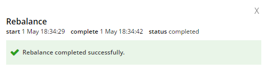

# Getting Started with Couchbase Server Community Edition

[학습 주소](https://docs.couchbase.com/tutorials/getting-started-ce/index.html)

## 설치 및 관리

설치는 도커로 진행

```docker
docker run -itd --name couchbase-server -p 8091-8094:8091-8094 -p 11210:11210 couchbase:community
```

1. 초기화 `http://localhost:8091` 접속
2. Setup New Cluster
3. 클러스터 명(couchbase)과 비밀번호 입력
4. Finish With Defaults

## 기존 데이터 가져오기

cbdocloader 도구를 통한 JSON 데이터 가져오기

> 웹 UI 에서 왼쪽 Settings, Sample Buckets 클릭시 예제용 버킷을 가져올 수 있다.

### cbdocloader

[cbdocloader](https://docs.couchbase.com/server/6.0/cli/cbdocloader-tool.html)

```text
cbdocloader -c [host] : 8091 -u [Administrator] -p [password] -b [bucket-name] -m [bucket-quota-MB] -d [source-file]
```

## 쿼리 및 검색

`N1QL` 을 사용한 쿼리

### `N1QL`

SQL 과 유사한 구문으로 사용하는 쿼리 언어

- `SELECT`: 반환 할 각 문서의 필드
- `FROM`: 조회할 데이터 버킷
- `WHERE`: 문서가 충족해야하는 조건

### 인덱스

색인을 사용하고 버킷을 쿼리가 가능하게 만들려면 하나 이상의 색인이 정의되어 있어야 한다. primary index, secondary index 두가지 인덱스가 있다.

```sql
CREATE INDEX ix_movies_genre ON `movies`(genre);
```

### 웹 UI 를 통한 검색

왼쪽 `Query` 탭에서 질의어 작성 후 실행

### REST API 로 검색

예시 ... 약간 ELK 랑 유사한 느낌

```json
curl -u Administrator:password -XPOST -H "Content-Type: application/json" \
http://localhost:8094/api/index/movies-index/query \
-d '{
  "explain": true,
  "fields": [
    "*"
  ],
  "highlight": {},
  "query": {
       "match": "drama",
      "field": "genre",
      "analyzer": "standard",
      "fuzziness": 2,
      "prefix_length": 3
    }
}'
```

## 클러스터 설정

### 프로비저닝

서버에 대한 자격 증명을 설정하고 서비스 할당과 메모리 할당량을 지정한다.

CLI, REST API 그리고 웹 UI 를 통해 노드를 프로비저닝을 할 수 있다.

### 실습

이미 설치할 때 기본 값으로 서버가 설정 되었는데, 웹 UI 기준 Settings 로 들어가면 서버에 설정을 수정할 수 있다.

### 다른 노드에 가입

도커로 실행환경 띄우다보니 시행착오 발생 [해당 내용 참고해 서버 2개 추가 실행](https://docs.couchbase.com/server/current/install/getting-started-docker.html)

```text
docker run -d --name cb2 couchbase
docker run -d --name cb3 couchbase

docker inspect -f '{{range .NetworkSettings.Networks}}{{.IPAddress}}{{end}}' cb2
docker inspect -f '{{range .NetworkSettings.Networks}}{{.IPAddress}}{{end}}' cb3
```



서버 새로 띄우고 WEB UI 에서 서버 탭에서 받은 아이피로 서버 추가



추가된 서버는 노란불이 뜨는데 내부 밸런싱을 위해 `Rebalance` 를 수행한다.



특정 버킷에 대해 설정에서 replica 를 설정할 수 있다.

## 자바로 개발

> 다른 리포지토리에서 실습
