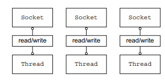
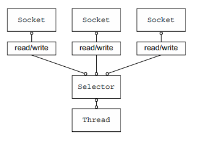

# Netty 의 개념과 아키텍쳐

> Netty (이하 네티) 는 고성능의 네트워킹 애플리케이션을 구현하기 위한 프레임워크이다.

네티는 크게 3가지 주요 사항을 가지낟.

1. 네티를 통해 애플리케이션을 구현할 때 네트워킹 전문가가 될 필요가 없다.
2. 네티는 기본 JAVA API 를 직접 사용하는 것보다 쉽다.
3. 네티는 애플리케이션을 네트워크 계층을 분리하는 상태로 개발하는 것과 같은 좋은 설계 방법을 장려한다.

고성능 시스템을 가지기 위해선 높은 수준의 코딩이 필요하다. 네트워킹, 멀티스레딩 및 동시성 제어 등 다양한 복잡한 상황에 대해 전문적인 스킬을 요구하는 것이다. 그러나 네티는 네트워크 초보자도 사용할수 있는 수준의 도메인 지식으로 구현이 가능하다.

네티는 프레임 워크로서 아키텍처 접근 방식과 디자인 패턴을 사용하기 때문에 다음에 대한 이야기를 서술한다.

- 관심사에 대한 분리 (비즈니스와 네트워크간의 디커플링)
- 모듈화와 이에 따른 재사용성
- 빠르게 테스트 가능한 구현력

## 자바 네트워킹의 역사

### Java API (Socket)

최초의 Java API (java.net) 은 기본적인 소켓에서 시작하는 기능만 제공하였다.

```java
ServerSocket serverSocket = new ServerSocket(portNumber); // (1)
Socket clientSocket = serverSocket.accept(); // (2)
BufferedReader in = new BufferedReader(new InputStreamReader(clientSocket.getInputStream())); // (3)
PrintWriter out = new PrintWriter(clientSocket.getOutputStream(), true);
String request, response;

while ((request = in.readLine()) != null) { // (4)
    if ("Done".equals(request) (
        break;
    }
    response = processRequest(request); // (5)
    out.println(response);
} 
```

1. `ServerSocket` 은 지정된 포트에 연결 요청을 수신한다.
2. `accept()` 호출은 연결이 설정되기 전까지 차단된다. (established)
3. 스트림 객체는 소켓 객체에 의해 파생된다.
4. 처리에 대한 루프를 수행한다.
5. 요청은 서버의 처리 방법에 따라 전달된다.

위 코드는 한 번에 하나의 연결에 대한 처리만 수행할 수 있다. 여러 개의 연결을 동시에 수행하기 위해선 새로운 요청에 대해 새로운 스레드로 할당해야한다.



좀 더 상세히 접근하도록 하면 다음과 같은 문제가 있을 수 있다.

1. 많은 스레드가 휴면 상태로 입출력 데이터가 라인을 대기할 수 있다.
2. 각 스레드는 OS 에 따라 스택 메모리 할당이 필요하다. (기본 64KB 에서 1 MB)
3. JVM 이 많은 스레드를 지원할수 있을지 모르지만 스레드 컨텍스트 스위칭에 따른 오버헤드에 따라 문제가 발생할 것이다.

> 3번의 케이스라면 10,000 개를 지원할 수 있다해도 10,000 개로 도달하기 전에 스레드 컨텍스트 스위칭 비용이 무시 못 할 범주에 도달하여 결국 터져 버린다는 뜻이다.

결국 이 접근 방식은 대량의 커넥션에는 부적합하다. 다행히 대안이 있다.

### Java NIO (java.nio)

위 상태에서 차단되지 않고 비차단되는 호출이 포함되어 대안이 될수 있다. non-blocking 지원에 대한 부분은 JDK 1.4 와 함께 도입되었다.

- `setsockopt()` 를 사용해 데이터가 없는 경우 읽기/쓰기 호출의 자원을 즉시 반환하도록 구성할 수 있다.
- 시스템 자체의 이벤트를 구독하고 알림을 사용하는 방식으로 non-blocking socket 를 등록할 수 있다.

NIO 는 원래 New Input/Output 의 약어 였으나 이젠 NIO 를 non-blocking 을 의미하는 것으로 생각한다. 반면에 blocking 은 OIO 로 불리기도한다.

### Selectors

> `java.nio.channels.Selector` 클래스는 Java NIO 구현의 핵심이다.

이는 이벤트 알림 API 를 통해서 non-blocking socket 를 준비할 수 있다.



모든 읽기/쓰기에 대한 작업에 완료 상태를 언제든지 확인할 수 있어 하나의 스레드가 여러 개의 연결을 처리할 수 있다. 기존 모델보다 훨씬 더 좋은 리소스 관리를 제공할 수 있게 된다.

- 하나의 스레드의 처리량이 늘어나 메모리와 컨텍스트 스위칭에 대한 비용이 감소한다.
- 스레드는 처리할 I/O 가 없는 경우 다른 작업으로 대상을 변경할 수 있다.

Java NIO API 를 직접 사용하여 올바르면서도 안전하게 수행하는건 쉽지 않다. 특히나 과부하 상태에 따른 처리는 오류가 많고 발생하기 쉬운 작업으로 이 대안으로 네티가 제안된다.

## 네티 소개

네티 전까지만해도 수천 명을 동시에 지원하는 클라이언트는 불가능하다고 판단 되었을 것이다. 그러나 앞으로 네티를 통해 이 기능을 당연하게 생각하고 이는 개발자로서 기준과 기대가 높아질 것으로 기대되는 바이다.

낮은 비용으로 큰 처리량과 확장성은 항상 제고된다.

우리는 항상 저수준의 API 를 직접 다루게 되면 복잡성이 두드러지고 가장 큰 기술에 대한 의존성이 발생하고 이는 이후 디커플링 되기 어려워 매우 고통스러운 과정을 겪게 된다. 네티는 이 고통을 벗어나기 위해 객체 지향의 기본 개념인 기본 구현의 복잡성을 숨겨버리고 추상화 시켜버리도록 했다.

- 설계 (Design)
  - OIO 와 NIO 둘 다 모든 전송 유형을 지원하는 통합 API
  - 간단하면서도 강력한 스레드 모델
  - 진짜 연결이 없는(True Connectionless) 데이터그램 소켓을 지원.
  - 재사용을 지원하기 위한 컴포넌트 체이닝 제공
- 용이성 (Ease of Use)
  - 광범위한 Javadoc 와 대규모 예제
  - JDK 1.6+ 이상에 필수 종속성 없음 (선택정 기능에 따른 추가 종속성 ... JDK 1.7+)
- 성능 (Performance)
  - Java API 보다 더 나은 처리량과 떠 짧은 대기 시간
  - pooling 과 재사용을 통한 리소스 소비 감소.
  - 최소한의 수준인 메모리 복사.
- 견고함 (Robustness)
  - 느리던 빠르던 과부하로 발생하는 `OutOfMemoryError` 는 없다.
  - 빠른 네트워크 구조에서 불공정한 읽기/쓰기 비율을 제거한다.
- 보안 (Security)
  - 완전한 SSL/TLS 및 StartTLS 를 지원.
  - Applet 이나 OSGI 와 같은 제한된 환경도 사용 가능.
- 커뮤니티 중심 (Community-driven)
  - 빠르면서도 자주 발생하는 릴리스

### 네티의 사용자는?

Apple, Twitter, Facebook, Google 등 다양한 대기업이 사용중이며 핵심 코드에 강력한 네트워크 추상화를 사용하였다. Firebase 는 HTTP 연결이 오래 지속되는 케이스에 Urban Airship 은 모든 종류의 푸시 알림에 사용되곤 하였다.

### 비동기와 이벤트 중심

비동기(asynchronous)를 우선 이해하도록 하자.

> 이메일: 보낸 메시지에 대한 응답을 받을 수도 있고, 받지 않을 수도 있고, 보내는 동안 예기치 않은 메시지를 받을 수 있다.

일상에서는 비동기가 너무 자연스러운 일이지만 컴퓨터 프로그램에서는 매우 특별한 문제를 나타낸다. 언제든지 그리고 순서에 상관없이 발생하는 이벤트에 응답할 수 있다! (비동기 이벤트도 순서가 지정된 관계를 가질수도 있다.)

이 기능은 "증가하는 작업량을 유능한 방식으로 처리하는 시스템" 이며, 이는 성장을 수용가능하면서도 확장할 수 있는 확장성을 가진다는 것이다.

- non-blocking 네트워크 호출은 작업이 완료될 때까지 기다리지 않는다. 완전한 비동기 I/O 는 이를 기반으로 하여 한 단계 더 발전한다. 비동기식 메소드는 즉시 반환되고 완료되면 직접 혹은 나중에 사용자에게 알린다.
- Selector 를 사용하면 더 적은 수의 스레드가 있는 이벤트에 대해 많은 연결을 모니터링할 수 있다.

#### 동기/비동기 블록킹/논 블록킹

- 동기: 현재 수행하는 작업이 끝날 때까지 기다리고 끝나면 다음 작업을 수행한다.
- 비동기: 현재 수행하는 작업의 응답을 기다리지 않고 다음 작업을 수행한다.

- 블로킹: 제어권을 받는다. 작업을 마치면 제어권을 준 대상에게 반환한다.
- 논블로킹: 제어권을 받지 않는다. 작업을 마치면 제어권을 가지거나 관리하는 대상에게 이를 알린다.

다음 섹션에서는 네티의 핵심 컴포넌트를 살펴본다 이는 구체적인 클래스로 바라보지 말고 도메인적인 객체로 생각하도록 하자. (객체지향적으로 추상화하여 받아들여보자.)
