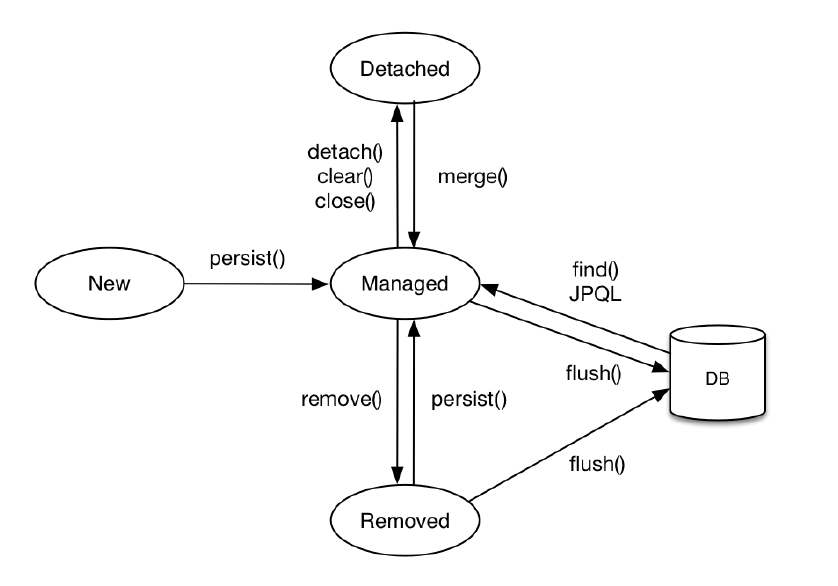

# 🗂 3장 영속성 관리

## 엔티티 매니저 팩토리와 엔티티 매니저

| 객체 | 비용 | 스레드 |
| --- | --- | --- |
| `EntityManagerFactory` | 객체 생성에 비용이 많이 들어간다. | 여러 스레드가 접근해도 안전하다. |
| `EntityManager` | 팩토리에서 생성하며 비용이 거의 들지 않는다. | 스레드간 공유시 동시성 문제가 발생하여 공유하면 안된다. |

데이터베이스를 하나만 사용하는 애플리케이션은 일반적을 1개의 팩토리를 사용한다.

엔티티 매니저는 데이터베이스 연결이 필요한 시점까지 커넥션을 얻지 않는다. 보통 트랜잭션 시작 시점에 커넥션을 획득한다.

엔티티 팩토리 매니저는 생성시점에 커넥션 풀을 만든다.

## 영속성 컨텍스트

엔티티를 영구 저장하는 환경으로 엔티티 매니저를 통해 엔티티를 저장하거나 조회하면 엔티티 매니저는 영속성 컨텍스트를 관리한다.

```java
// 엔티티 매니저를 사용하여 회원 엔티티를 영속성 컨텍스트에 저장한다.
em.persist(member);
```

## 엔티티 생명주기

- 비영속(new/transient) : 영속성 컨텍스트와 전혀 관계가 없는 상태
- 영속(managed) : 영속성 컨텍스트에 저장된 상태
- 준영속(detached) : 영속성 컨텍스트에 저장되었다가 분리된 상태
- 삭제(deleted) : 삭제된 상태



### 비영속

엔티티 객체를 생성한 상태

### 영속

엔티티 객체를 저장하여 영속성 컨텍스트가 관리하는 엔티티가 된 상태

`em.find()` 나 JPQL 을 사용하여 조회한 엔티티도 영속성 컨텍스트가 관리하는 영속 상태다.

### 준영속

영속성 컨텍스트가 관리하던 영속 상태의 엔티티를 관리하지 않게되는 상태

`em.detach()` 호출시 영속성 컨텍스트에서 분리된다.

### 삭제

엔티티를 영속성 컨텍스트와 데이터베이스에서 삭제한다. `em.remove()`

## 영속성 컨텍스트 특징

- 영속성 컨텍스트와 식별자 값: 영속 상태는 식별자 값이 반드시 있어야 한다. (@Id 로 테이블의 기본 키와 매핑한 값)
- 영속성 컨텍스트와 데이터베이스 저장: 트랜잭션을 커밋하는 순간 영속성 컨텍스트에 저장된 엔티티를 데이터베이스를 반영한다. 이를 플러시(flush)라 한다.

1. 1차 캐시
2. 동일성 보장
3. 트랜잭션을 지원하는 쓰기 지원
4. 변경 감지
5. 지연로딩

### 엔티티 조회

```java
// 엔티티 영속 
// 1차 캐시 o 데이터베이스 x
em.persist(member);
```

캐시의 키는 member 의 `@Id` 식별자 값이다. `em.find()` 실행시 처음 1차 캐시에서 색인하고 없는 경우 데이터베이스를 조회하여 엔티티를 생성한다. 그리고 1차 캐시에 저장되고 엔티티를 반환한다.

또한 이전 장점으로 살펴본 반복 호출을 하여도 1차 캐시에 있는 같은 엔티티 인스턴스를 반환하기에 동일성을 보장한다.

### 엔티티 등록

`transaction.commit()` 시 엔티티 매니저는 영속성 컨텍스트를 플러시한다. 플러시는 영속성 컨텍스트의 변경 내용을 데이터베이스에 동기화 하는 작업이다.

여러개의 엔티티 등록 동작도 트랜잭션 커밋 이전 시점이라면 지연 SQL 저장소에 차곡차곡 쌓여있다가 한 번에 전달되어 실행된다.

### 엔티티 수정

엔티티의 변경사항을 감지하여 데이터베이스에 자동으로 반영한다. 이를 변경 감지(dirty checking)라고 한다.

1. 엔티티를 영속성 컨텍스트에 보관시 최초의 상태: 스냅샷
2. 플러시 시점에 스냅샷과 엔티티를 비교

플러시 호출 → 스냅샷과 엔티티 비교 → 수정된 엔티티는 수정 쿼리를 생성하여 쓰기 지연 SQL 저장소 전달 → 쓰기 지연 저장소를 데이터베이스에 전달 → 트랜잭션 커밋

변경 감지는 영속성 컨텍스트가 관리하는 영속 상태의 엔티티에만 적용된다.

필드가 많거나 저장되는 내용이 너무 크면 수정된 데이터만 사용하도록 동적 UPDATE SQL 을 생성하는 전략을 선택한다.

`@DynamicUpdate` 어노테이션을 사용하면 수정된 데이터만 동적으로 UPDATE SQL 을 생성한다. 상황에 따라 다르지만 컬럼이 30개 이상인 경우이며, 직접 성능 테스트를 통해 최적화를 하는 것이 바람직하다.

### 엔티티 삭제

삭제 대상 엔티티를 조회하고 앞서본 기능과 비슷하게 `em.remove(member)` 를 실행 후 트랜잭션 커밋시 삭제된다. 실행 시점에 영속성 컨텍스트에 제거된다.

## 플러시

플러시는 영속성 컨텍스트의 변경 내용을 데이터베이스에 반영하는 것을 말한다.

플러시 방법은 총 3가지가 있다.

1. 직접호출
2. 트랜잭션 커밋시 플러시 자동 호출
3. JPQL 쿼리 실행시 플러시 자동 호출

### 플러시 모드

- `FlushModeType.AUTO` : 커밋이나 쿼리를 실행할 때 플러시(기본값)
- `FlushModeType.COMMIT` : 커밋할 때만 플러시

`FlushModeType.COMMIT` 은 성능 최적화를 위해 사용한다.

## 준영속

준영속상태의 엔티티는 영속성 컨텍스트가 제공하는 기능을 사용할 수 없다.

1. `em.detach(entity)` : 특정 엔티티만 준영속상태로 전환한다.
2. `em.clear()` : 영속성 컨텍스트를 완전히 초기화한다.
3. `em.close()` : 영속성 컨텍스트를 종료한다.

### 준영속 상태의 특징

- 거의 비영속 상태에 가깝다. : 1차 캐시, 쓰기 지연, 변경 감지, 지연 로딩을 보함한 영속성 컨텍스트가 제공하는 기능이 동작하지 않는다.
- 식별자 값을 가지고 있다. : 준영속 상태는 이미 영속 상태였으므로 식별자 값을 가지고 있다.
- 지연 로딩을 할 수 없다. : 실제 객체 대신 프록시 객체를 로딩하고 해당 객체를 실제 사용시 영속성 컨텍스트로 데이터를 조회하는 방법이지만 준영속 상태이기에 영속성 컨텍스트가 관리하지 않는다.

### 병합: merge()

준영속 상태의 엔티티를 받아 새로운 영속 상태의 엔티티를 반환한다.
