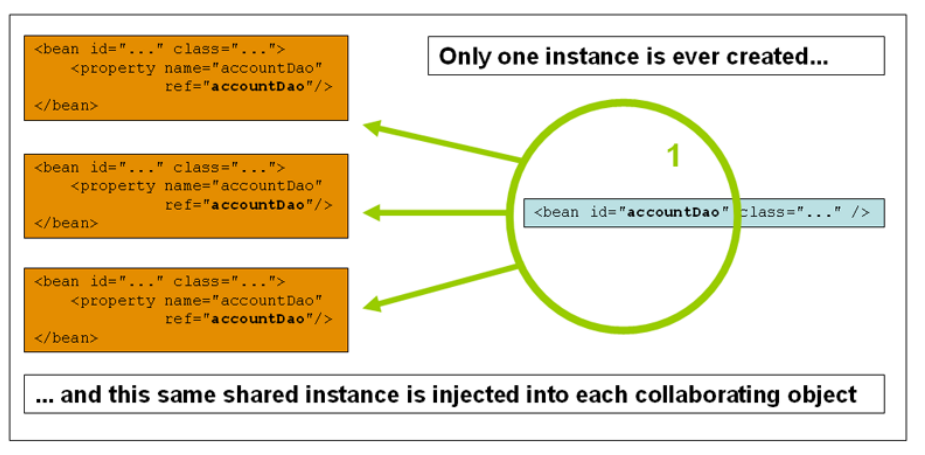
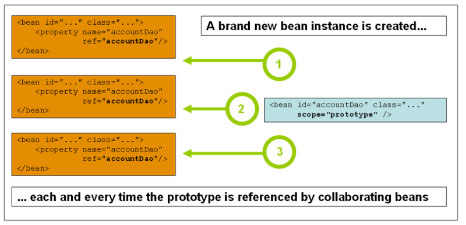

# 빈 스코프

빈 정의를 작성할 때, 해당 빈 정의로 정의 된 클래스의 실제 인스턴스를 작성하기 위한 레시피를 작성한다. 빈 정의가 **레시피라는 개념은 클래스와 마찬가지로 단일 레시피에서 많은 객체 인스턴스를 생성** 할 수 있기 때문에 중요하다.

특정 빈 정의로 생성된 객체에 연결할 다양한 의존성과 설정 값뿐만 아니라 생성된 객체의 범위도 제어할 수 있다. 이 접근 방법은 자바 클래스 레벨에서 객체의 범위를 생성하는 대신, 설정을 통해 객체의 범위를 선택할 수 있으므로 강력하고 유연하다.

빈은 여러가지 범위 중에 하나로 정의할 수 있으며, 스프링은 6가지 범위를 지원한다. 이 중 5개는 웹 기반의 `ApplicationContext` 를 사용하는 경우에만 사용할 수 있다.

| 스코프 | 명세 |
| --- | --- |
| singleton | (기본값) 단일 빈 정의를 스프링 IoC 컨테이너 당 하나의 객체 인스턴스로 범위로 지정. |
| prototype | 단일 빈 정의를 원하는 수의 객체 인스턴스로 확장. |
| request | 단일 빈 정의를 HTTP 요청의 라이프 사이클 범위로 지정한다. 각 HTTP 요청에는 단일 빈 정의에서 작성된 빈 자체의 인스턴스가 있다. 웹 기반 `ApplicationContext` 의 컨텍스트에서만 유효하다. |
| session | 단일 빈 정의를 HTTP 세션의 라이프 사이클 범위로 지정한다. 웹 기반 `ApplicationContext` 의 컨텍스트에서만 유효하다. |
| application | 단일 빈 정의를 `ServletContext` 의 라이프 사이클 범위로 지정한다. 웹 기반 `ApplicationContext` 의 컨텍스트에서만 유효하다. |
| websocket | 단일 빈 정의를 `WebSocket` 의 라이프 사이클 범위로 지정한다. 웹 기반 `ApplicationContext` 의 컨텍스트에서만 유효하다. |

스프링 3.0 부터 스레드 스코프가 사용 가능하지만 기본적으로 등록되지 않았다.

## 싱글톤 스코프

> 싱글톤 빈의 유일하고 공유된 인스턴스만 관리되고 해당 빈과 일치하는 id 의 빈에 대한 모든 요청은 스프링 컨테이너가 같은 빈 인스턴스를 반환된다.

빈 정의를 싱글톤 범위로 정의하면 스프링 IoC 컨테이너는 해당 빈 정의로 정의된 객체의 인스턴스를 정확히 1개의 인스턴스를 반환한다. 이 하나의 인스턴스는 싱글톤 빈 같은 캐시로 저장하고 해당 빈에 대한 이후의 모든 요청이나 참조에 캐시된 객체를 반환한다.



싱글톤 빈에 대한 스프링의 개념은 Gang of Four(GoF) 패턴 책에 정의된 싱글톤 패턴과 다르다. GoF 싱글톤은 클래스 로더 당 하나의 특정 클래스 인스턴스만 생성되도록 **객체의 범위를 하드코딩**한다. 스프링 싱글톤의 범위는 컨테이너 및 빈마다 가장 잘 묘사된다.

즉, 단일 스프링 컨테이너에서 특정 클래스에 대해 싱글톤 스코프 빈 정의를 하면 스프링 컨테이너는 해당 **빈 정의로 정의된 클래스의 인스턴스 하나만 생성**한다. 싱글톤 스코프는 스프링의 기본 범위이다. XML 에서 빈을 싱글톤 스코프로 정의하려면 다음과 같다.

```xml
<bean id="accountService" class="com.foo.DefaultAccountService"/>
<!-- 다음은 동일하지만 중복된다. (싱글톤 범위가 기본값 임) -->
<bean id="accountService" class="com.foo.DefaultAccountService" scope="singleton"/>
```

## 프로토타입 스코프

프로토타입 스코프는 특정 빈에 대해 요청이 이루어질 때 새로운 빈 인스턴스를 생성한다. 빈은 다른 빈으로 주입되거나 컨테이너에서 `getBean()` 메소드를 호출을 통해 빈을 요청한다. 원칙적으로 **상태를 가지고 있는 빈은 프로토타입 스코프를, 상태를 가지고 있지 않는 빈에 대한 싱글톤 스코프**를 사용해야 한다. DAO 는 대부분 상태를 유지하지 않기 때문에 프로토타입으로 구성되지 않는다.



```xml
<bean id="accountService" class="com.foo.DefaultAccountService" scope="prototype"/>
```

> 다른 스코프와 달리 스프링은 프로토타입 빈의 라이프 사이클을 관리하지 않는다.

컨테이너는 프로토타입 객체를 인스턴스화, 설정하고 다른 방법으로 모은 뒤 프로토타입 인스턴스의 어떠한 기록없이 클라이언트에게 전달한다. 따라서 초기화 라이프 사이클 반환 메소드가 범위와 관계없이 모든 객체에서 호출되었지만 프로토타입 스코프는 소멸 라이프 사이클 반환 메소드는 호출되지 않는다.

클라이언트 코드는 프로토타입 스코프 객체를 정리하고 프로토타입 빈이 가지고 있는 비싼 리소스를 릴리즈 해야한다. 보유하고 있는 리소스를 스프링 컨테이너에서 가져오려면 프로토타입 스코프의 빈에 의해 정리해야하는 빈에 대한 참조를 보유하는 사용자 **빈 포스트 프로세서**를 사용해보면 된다.

어떤 관점에서, 프로토타입 범위의 빈에 대한 스프링 컨테이너의 역할은 자바 new 연산자를 대체한다. 그 시점을 지난 모든 라이프 사이클 관리는 클라이언트가 처리해야한다. 스프링 컨테이너에서 빈의 라이프 사이클에 대한 자세한 내용은 라이프 사이클 콜백 섹션에서 다룬다.

### 프로토타입 빈 의존성을 가지는 싱글톤 빈

> 싱글톤 빈 →[의존성]→ 프로토타입 빈

프로토타입 빈에 대해 의존성이있는 싱글톤 빈을 사용할 때 인스턴스화시 의존성이 해결된다는 것에 유의해야한다. 따라서 프로토타입 빈을 싱글톤 빈에 의존성을 주입한다는 것은 새로운 프로토타입 빈이 인스턴스화 된 다음 싱글톤 빈에 의존성이 해결된다. 프로토타입 인스턴스는 **싱글톤 빈에 제공되는 유일한 인스턴스가 된다.**

> 싱글톤 빈 → 프로토타입 빈 인스턴스화 →[의존성]→ 프로토타입 빈

그러나 런타임시 싱글톤 빈이 프로토타입 빈의 새로운 인스턴스를 반복적으로 획득한다고 한다면, 스프링 컨테이너가 최초에 싱글톤 빈을 인스턴스화하고 의존성을 해결하고 주입할 때 한 번만 발생하기 때문에 이후의 **프로토 타입 빈을 싱글톤 빈에 의존성 주입을 할 수 없다.** 만약 런타임에 프토토타입 빈의 새 인스턴스가 2번 이상 필요할 경우 메소드 주입을 참조한다.

## 빈 웹 스코프

리퀘스트, 세션, 애플리케이션 그리고 웹소켓 스코프들은 오직 웹기반 `ApplicationContext` 에서만 사용 가능하다. (`XmlWebApplicationContext` 와 같은) 만약 이 스코프들을 `ClassPathXmlApplicationContext` 와 같은 일반적인 스프링 IoC 컨테이너와 함께 사용한다면 알 수 없는 빈 범위에 대한 `IllegalStateException` 이 발생한다.

### 초기 웹 설정

나열한 스코프들을 빈의 스코프로 지정하기 위해서 빈을 정의하기 전에 초기 설정이 필요하다. (이 설정은 표준, 싱글톤 그리고 프로토타입에는 필요하지않다.) 이 초기 설정을 수행하는 방법은 특정 `Servlet` 환경에 따라 다르다.

스프링 웹 MVC에서 범위가 지정된 빈에 접근하면 사실상 스프링 `DispatherServlet` 에 의해 처리되는 요청 내에서 특별한 설정이 필요하지 않다. `DispatherServlet` 는 이미 관련 상태를 이미 드러내고 있다.
 스프링 `DispatherServlet` (예를 들어, JSF 또는 Struts 를 사용할 때) 외부에서 요청이 처리 된 Servlet 2.5 웹 컨테이너를 사용하는 경우 `org.springframework.web.context.request.RequestContextListener ServletRequestListener` 를 통해 등록해야 한다.

Servlet 3.0 이상에서는 `WebApplicationInitializer` 인터페이스를 통해 프로그래밍 방식으로 수행할 수 있다. 혹은 이전 컨테이너의 경우 웹애플리케이션 `web.xml` 파일에서 다음 선언을 추가한다.

```xml
<web-app>
    <!-- ... -->
    <listener>
        <listener-class>
        org.springframework.web.context.request.RequestContextListener
        </listener-class>
    </listener>
    <!-- ... -->
</web-app>
```

또는 리스너 설정에 문제가 있다면 스프링에 `RequestContextFilter` 사용을 고려해야한다. 필터 매핑의 경우 주변 웹 애플리케이션 구성에 따라 다르므로 적절하게 변경해야한다.

```xml
<web-app>
    <!-- ... -->
    <filter>
        <filter-name>requestContextFilter</filter-name>
        <filter-class>org.springframework.web.filter.RequestContextFilter</filter-class>
    </filter>
    <filter-mapping>
        <filter-name>requestContextFilter</filter-name>
        <url-pattern>/*</url-pattern>
    </filter-mapping>
    <!-- ... -->
</web-app>
```

`DispatherServlet`, `RequestContextListener` 그리고 `RequestContextFilter` 는 모두 똑같은 작업을 수행한다. 

> 즉, 요청을 처리하는 **스레드에 HTTP 요청 객체를 바인딩한다.**

이렇게 하면 요청 및 세션 범위가 있는 빈을 호출 체인에서 사용할 수 있다.

## 리퀘스트 스코프

```xml
<bean id="loginAction" class="com.foo.LoginAction" scope="request"/>
```

스프링 컨테이너는 각 HTTP 요청마다 `LoginAction` 빈 정의를 사용하여 새로운 `loginAction` 인스턴스를 생성한다. 즉, `LogionAction` 빈은 HTTP 요청 레벨에서 스코프가 지정된다. 동일한 `loginAction` 빈 정의에서 작성된 다른 인스턴스는 상태 변경 사항을 볼 수 없기에 원하는만큼 작성된 인스턴스의 내부 상태를 변경 가능하다. 이 것은 개별적인 요청에서 특히 중요한데, 요청 처리를 완료하면 요청에 적용되는 빈은 버리기 때문이다.

어노테이션 기반 설정(Java Config)을 사용하는 경우 `@RequestScope` 어노테이션을 사용하여 리퀘스트 스코프로 컴포넌트를 할당 할 수 있다.

```java
@RequestScope
@Component
public class LoginAction {
    // ...
}
```

## 세션 스코프

```xml
<bean id="userPreferences" class="com.foo.UserPreferences" scope="session"/>
```

스프링 컨테이너는 단일 HTTP 세션의 수명 동안 `UserPreferences` 빈 정의를 사용하여 새로운 `userPreferences` 인스턴스를 생성한다. 즉 `UserPreferences` 빈은 HTTP 세션 레벨에서 스코프가 지정된다. 리퀘스트 스코프와 마찬가지로 `userPreferences` 빈은 다른 HTTP 세션 인스턴스와 독립적이기 때문에 원하는 만큼 생성된 인스턴스의 내부 상태를 변경 할 수 있다. 이는 개별 HTTP 세션이 고유한 것임을 입증한다. HTTP 세션이 만료되면 만료된 세션 스코프 빈도 삭제된다.

어노테이션 기반 설정을 사용한다면 `@SessionScope` 어노테이션을 사용해 세션 스코프 컴포넌트로 할당할 수 있다.

```java
@SessionScope
@Component
public class UserPreferences {
    // ...
}
```

## 애플리케이션 스코프

```xml
<bean id="appPreferences" class="com.foo.AppPreferences" scope="application"/>
```

스프링 컨테이너는 전체 웹 애플리케이션에 대해 `AppPreferences` 빈 정의를 사용하여 새로운 `appPreferences` 인스턴스를 생성한다. 즉 `appPreferences` 빈은 `ServletContext` 레벨에서 스코프로 지정되며, 일반적인 `ServletContext` 속성으로 저장된다. 스프링 싱글톤 빈과 비슷하지만 2가지가 크게 다르다.

- `ApplicationContext` 가 아닌 `ServletContext` 당 하나의 싱글톤 빈이다.
- 실제로 노출되고 `ServletContext` 속성으로 저장된다.

어노테이션 기반 설정을 사용한다면 `@ApplicationScope` 어노테이션을 사용해 애플리케이션 스코프로 할당할 수 있다.

```java
@ApplicationScope
@Component
public class AppPreferences {
    // ...
}
```

## 스코프와 의존성

스프링 IoC 컨테이너는 빈 인스턴스화 뿐만 아니라 협력 객체들(또는 의존성)의 연결까지 관리한다. 더 긴 수명 스코프의 다른 빈에 (예를 들어) HTTP 리퀘스트 스코프 지정 빈을 주입하려는 경우, 스코프가 지정된 빈 대신 AOP 프록시를 주입해야 한다.

> 즉, 스코프가 지정된 객체와 동일한 공용 인터페이스를 노출하는 프록시 객체를 주입할 필요가 있다.

관련 범위(예: HTTP 요청)에서 실제 대상 객체를 획득하고 실제 객체에 메소드 호출을 위임할 수도 있다.

### Note

또한 싱글톤 스코프 빈 간에 `<aop:scoped-proxy/>` 를 사용할 수도 있다. 참조는 직렬화 가능하며 따라서 직렬화 해제시 대상 싱글톤 빈을 다시 얻을 수 있는 중간 프록시를 통과한다. 프로토타입 스코프 빈에 대해 `<aop:scoped-proxy/>` 를 사용할 때, 공유된 프록시의 모든 메소드 호출은 호출이 전달되는 새로운 목표 인스턴스를 생성하게 된다.

범위가 좁은 프록시만 수명이 짧은 스코프의 빈에 액세스 할 수 있는 유일한 방법이 아니다. 주입 지점 (즉, 생성자/세터 인수 또는 autowired 필드)을 `ObjectFactory<MyTargetBean>` 으로 선언할 수 있다. `getObject()` 호출은 필요할 때마다 현재 인스턴스를 검색할 수 있다. 인스턴스를 작성하거나 별도로 저장해야한다.

이 JSR-330 변형은 `Provider` 라고 하며 `Provider<MyTargetBean>` 선언 및 모든 검색 시도에 해당하는 `get()` 호출과 함께 사용된다.

```xml
<?xml version="1.0" encoding="UTF-8"?>
<beans xmlns="http://www.springframework.org/schema/beans"
    xmlns:xsi="http://www.w3.org/2001/XMLSchema-instance"
    xmlns:aop="http://www.springframework.org/schema/aop"
    xsi:schemaLocation="http://www.springframework.org/schema/beans
    http://www.springframework.org/schema/beans/spring-beans.xsd
    http://www.springframework.org/schema/aop
    http://www.springframework.org/schema/aop/spring-aop.xsd">

    <!-- HTTP 세션 스코프 빈은 프록시로 노출된다. -->
    <bean id="userPreferences" class="com.foo.UserPreferences" scope="session">
        <!-- 컨테이너에게 주변 빈을 프록시하도록 명령한다. -->
        <aop:scoped-proxy/>
    </bean>

    <!--  빈에 대한 프록시가 주입된 싱글톤 스코프 빈 -->
    <bean id="userService" class="com.foo.SimpleUserService">
        <!-- 프록시 된 userPreferences 빈에 대한 참조 -->
        <property name="userPreferences" ref="userPreferences"/>
    </bean>
</beans>
```

프록시를 생성하기 위해, 스코프 된 빈 정의에 자식 `<aop:scoped-proxy/>` 요소를 정의한다. 요청, 세션 및 사용자 스코프로 정의 된 빈 정의에 `<aop:scoped-proxy/>` 요소가 필요한 이유가 무엇일까? 다음 싱글톤 빈 정의를 살펴보고 정의한 스코프에 대해 정의해야하는 것과 대조해보도록 한다. (다음 정의는 불완전하다.)

```xml
<bean id="userPreferences" class="com.foo.UserPreferences" scope="session"/>
<bean id="userManager" class="com.foo.UserManager">
    <property name="userPreferences" ref="userPreferences"/>
</bean>
```

싱글톤 빈 `userManager` 는 HTTP 세션 스코프 `userPreferences` 에 대한 참조가 주입된다. 주목해야할 점은 `userManager` 빈은 하나의 컨테이너 당 **한 번만 인스턴스화 될 것이고, 의존성도 한 번만 주입된다.**

> 즉, `userManager` 빈은 동일한 `userPreferences` 객체. 최초로 주입된 `userPreferences` 객체에서만 작동한다.

짧은 세션 스코프가 지정된 빈을 오래 존속된 범위 빈에 주입할 때 (HTTP 세션 스코프 협업 빈을 싱글톤 스코프 빈에 대한 의존성으로 주입하는 경우) 의도된 동작이 아니다.

> 세션 스코프 빈 →[의존성]→ 싱글톤 스코프 빈

오히려 하나의 `userManager` 객체가 필요하며 HTTP 세션의 수명동안 HTTP 세션과 관련된 `userPreferences` 객체가 필요하다. 따라서 컨테이너는 스코프 지정 메커니즘(HTTP 요청, 세션 등)에서 실제 `UserPreferences` 객체를 가져올 수 있는 `UserPreferences` 클래스(이상적으로는 `UserPreferences` 인스턴스인 객체)와 완전히 동일한 공용 인터페이스를 제공하는 객체를 만든다. 컨테이너는 이 `UserPreferences` 참조가 프록시임을 모르는 `userPreferences` 빈에 프록시 객체를 주입한다.

이 예제에서 `UserManager` 인스턴스가 의존성 주입된 `UserPreferences` 객체에서 메소드를 호출하면 실제로는 프록시에서 메소드를 호출하고 있다. 그런 다음 프록시는 실제 `UserPreferences` 객체에서 HTTP 세션을 가져오고 검색된 실제 `UserPreferences` 객체에 메소드 호출을 위임한다.

따라서 협업 객체에 요청 스코프 및 세션 스코프 빈을 주입할 때 다음과 같은 완전한 구성이 필요로한다.

```xml
<bean id="userPreferences" class="com.foo.UserPreferences" scope="session">
    <aop:scoped-proxy/>
</bean>
<bean id="userManager" class="com.foo.UserManager">
    <property name="userPreferences" ref="userPreferences"/>
</bean>
```
