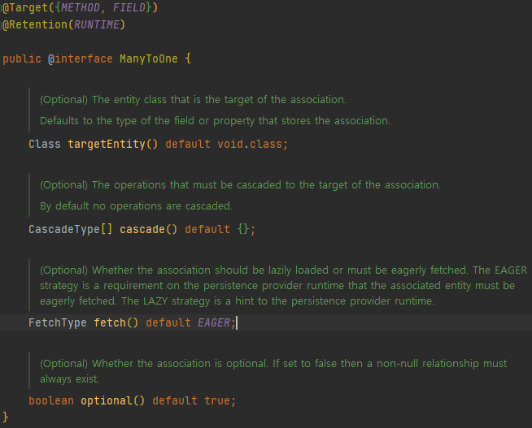

# JPA

## [코드] 모든 연관관계는 지연로딩으로 설정

> `@ManyToOne(fetch = FetchType.LAZY)`

- 즉시로딩(`EAGER`)은 예측이 어렵고, 어떤 SQL 이 실행될지 추적하기 어렵다.
- JPQL 실행시 [N + 1](./issue/N+1%20문제/README.md) 문제가 자주 발생한다.
- 엔티티를 함께 조회해야 하면, fetch join 또는 엔티티 그래프 기능을 사용하자.
- `@XToOne` 관계는 기본 값이 즉시 로딩이므로 직접 지연 로딩으로 설정해야 한다.



- - -

## [코드] 컬렉션 필드 초기화

> `private List<Category> child = new ArrayList<>();`

엔티티 영속화시 컬렉션을 감싸서 내장 컬렉션으로 변경한다. 내부 메커니즘 문제가 발생할 수 있다. 필드 레벨에서 선언하는게 깔끔하다.

## [코드] `@Transactional(readOnly=true)`

> `@Transactional(readOnly=true)`

1. 서비스 레이어에 `@Transactional(readOnly=true)`
2. 읽기 외의 기능을 사용하는 메소드는 명시적으로 `@Transactional` 사용

- - -

## [이론] Fetch Join

> 페치 조인은 SQL 한 번으로 연관된 엔티티들을 함께 조회할수 있어 SQL 호출 횟수를 줄여 성능을 최적화할 수 있다.

```sql
-- JPQL
select m from Member m join fetch m.team

-- SQL
SELECT
    M.*,
    T.*
FROM MEMBER M
INNER JOIN TEAM T ON M.TEAM_ID=T.ID
```

**Fetch Join** 테이블

| `ID` (PK) | `NAME` | `TEAM_ID` (FK) | `ID` (PK) | `NAME` |
| --- | --- | --- | --- | --- |
| 1 | 회원 1 | 1 | 1 | 팀A |
| 2 | 회원 2 | 1 | 1 | 팀A |
| 3 | 회원 3 | 2 | 2 | 팀B |

1. 지연로딩을 설정해도 지연로딩이 일어나지 않는다.
2. 조인된 엔티티는 프록시 객체가 아닌 실제 객체다.

일대다[팀 → 회원] 연관관계의 테이블 기준으로 페치 조인시 중복이 발생할 수 있다. 이 경우 `select distinct` 를 통해 중복을 제거할 수 있다.

- - -

## [이론] 변경 감지와 병합

> **엔티티 변경은 항상 변경 감지를 사용하도록 하자. 병합은 의도하지 않은 변경이 발생한다.**

- 변경 감지: 영속성 컨텍스트는 관리하는 엔티티가 변경이 되면 커밋 시점에 변경을 감지하여 원본에 반영한다.

- 병합(`merge(a)`): 준영속 엔티티 a 값으로 영속성 컨텍스트에서 조회한다. (1차/디비) 조회된 영속 엔티티 b 의 값을 준영속 엔티티 a 값으로 전부 바꾼다. 이후는 변경 감지 흐름과 동일

변경 감지 기능을 사용하면 원하는 속성만 선택해서 변경할 수 있지만, 병합을 사용하면 모든 속성이
변경된다. 병합시 값이 없으면 `null` 로 업데이트 할 위험도 있다.
