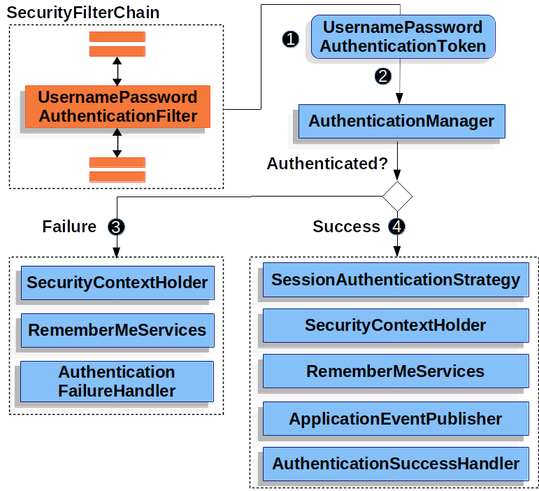

# Authentication mechanism

제공하는 **인증 메커니즘**은 다음과 같다.

| 종류 | 설명 |
| --- | --- |
| Username and Password | 사용자 이름/비밀번호로 인증하는 방법 |
| OAuth 2.0 Login | OpenID Connect를 사용한 OAuth 2.0 로그인과 비표준 OAuth 2.0 로그인 (i.e. GitHub) |
| SAML 2.0 Login | SAML 2.0 로그인 |
| Central Authentication Server (CAS) | Central Authentication Server (CAS) 지원 |
| Remember Me | 세션이 만료된 사용자를 기억하는 방법 |
| JAAS Authentication | JAAS를 사용한 인증 |
| OpenID | OpenID 인증 (OpenID Connect와 혼동하지 말 것) |
| 사전 인증 시나리오 | 인증은 SiteMinder나 Java EE security같은 외부 메커니즘으로 처리하면서, 스프링 시큐리티로 권한 인가와 주요 취약점 공격을 방어할 수 있다. |
| X509 Authentication | X509 인증 |

## Username/Password Authentication

사용자 이름과 비밀번호 검증은 사용자를 인증할 때 가장 많이 사용하는 방법 중 하나다. 그렇기 때문에 스프링 시큐리티는 이름과 비밀번호로 인증할 수 있는 방법을 종합적으로 지원한다.

Reading the Username & Password

스프링 시큐리티는 HttpServletRequest에서 이름과 비밀번호를 읽을 수 있는 다음 메커니즘을 기본으로 제공한다:

- 폼 로그인
- 기본 인증
- 다이제스트 인증

Storage Mechanisms

이름/비밀번호 조회 메커니즘은 지원하는 저장 메커니즘 중 어떤 것과도 조합할 수 있다:

- 인메모리 인증과 심플 스토리지
- JDBC 인증과 관계형 데이터베이스
- UserDetailsService 와 커스텀 데이터 스토어
- LDAP 인증과 LDAP 스토리지

### 폼 로그인

스프링 시큐리티는 html 폼 기반 사용자 이름/비밀번호 인증을 지원한다. 이번 섹션에선 스프링 시큐리티의 폼 기반 인증 동작 방식을 설명한다.

스프링 시큐리티에서 폼 기반 로그인이 어떻게 동작하는지 살펴보자. 먼저 로그인 폼으로 리다이렉트하는 방법을 설명한다.


이전에 설명했던 SecurityFilterChain 다이어그램을 기반으로 그린 그림이다.

1. 먼저 사용자가 권한이 없는 리소스 `/private` 에 인증되지 않은 요청을 보낸다.
2. 스프링 시큐리티의 `FilterSecurityInterceptor` 에서 `AccessDeniedException` 을 던져 인증되지 않은 요청을 거절했음을 알린다.
3. 인증되지 않은 사용자이므로 `ExceptionTranslationFilter` 에서 인증을 시작하고, 설정한 `AuthenticationEntryPoint` 로 로그인 페이지로의 리다이렉트 응답을 전송한다. `AuthenticationEntryPoint` 는 대부분 `LoginUrlAuthenticationEntryPoint` 인스턴스다.
4. 그러면 브라우저는 리다이렉트된 로그인 페이지를 요청한다.
5. 어플리케이션에선 로그인 페이지를 렌더링해야 한다.

username 과 password를 제출하면 `UsernamePasswordAuthenticationFilter` 가 이 값을 인증한다. `UsernamePasswordAuthenticationFilter` 는 `AbstractAuthenticationProcessingFilter` 를 상속했기 때문에 다이어그램도 비슷하다.



이전에 설명했던 SecurityFilterChain 다이어그램을 기반으로 그린 그림이다.

1. 사용자가 username 과 password 를 제출하면 `UsernamePasswordAuthenticationFilter` 는 `HttpServletRequest` 에서 이 값을 추출해 `Authentication` 유형 중 하나인 `UsernamePasswordAuthenticationToken` 을 만든다.
2. 그 다음엔 `UsernamePasswordAuthenticationToken` 을 `AuthenticationManager` 로 넘겨 인증한다. `AuthenticationManager` 상세 동작은 사용자 정보를 저장한 방식에 따라 다르다.
3. 인증에 실패하면
    - `SecurityContextHolder` 를 비운다.
    - `RememberMeServices.loginFail` 을 실행한다. remember me 를 설정하지 않았다면 아무 동작도 하지 않는다.
    - `AuthenticationFailureHandler` 를 실행한다.
4. 인증에 성공하면
    - `SessionAuthenticationStrategy` 에 새로 로그인했음을 통보한다.
    - `SecurityContextHolder` 에 `Authentication` 을 세팅한다.
    - `RememberMeServices.loginSuccess` 를 실행한다. remember me 를 설정하지 않았다면 아무 동작도 하지 않는다.
    - `ApplicationEventPublisher` 는 `InteractiveAuthenticationSuccessEvent` 를 발생시킨다.
    - `AuthenticationSuccessHandler` 를 실행한다. 보통 로그인 페이지로 리다이렉트할 때는 `SimpleUrlAuthenticationSuccessHandler` 가 `ExceptionTranslationFilter` 에 저장된 요청으로 리다이렉트한다.

스프링 시큐리티에선 폼 로그인이 디폴트로 활성화된다. 하지만 서블릿 기반 설정을 사용한다면 폼 기반 로그인을 명시해야 한다. 최소한 아래와 같은 설정이 있어야 한다:

```java
protected void configure(HttpSecurity http) {
    http
        // ...
        .formLogin(withDefaults());
}
```

```xml
<http>
    <!-- ... -->
    <form-login />
</http>
```

이 설정에선 디폴트 로그인 페이지로 렌더링한다. 프로덕션에서 사용할 어플리케이션은 대부분 커스텀 로그인 폼이 필요하다. 커스텀 로그인 폼을 설정하는 방법은 아래에 있다.

```java
protected void configure(HttpSecurity http) throws Exception {
    http
        // ...
        .formLogin(form -> form
            .loginPage("/login")
            .permitAll()
        );
}
```

```xml
<http>
    <!-- ... -->
    <intercept-url pattern="/login" access="permitAll" />
    <form-login login-page="/login" />
</http>
```

스프링 시큐리티 설정에 로그인 페이지를 명시했다면 페이지 렌더링을 직접 구현해야 한다. 다음은 로그인 페이지 `/login` 에서 필요한 HTML 로그인 폼을 생성하는 타임리프 템플릿이다:

> src/main/resources/templates/login.html

```html
<!DOCTYPE html>
<html xmlns="http://www.w3.org/1999/xhtml" xmlns:th="https://www.thymeleaf.org">
    <head>
        <title>Please Log In</title>
    </head>
    <body>
        <h1>Please Log In</h1>
        <div th:if="${param.error}">
            Invalid username and password.</div>
        <div th:if="${param.logout}">
            You have been logged out.</div>
        <form th:action="@{/login}" method="post">
            <div>
            <input type="text" name="username" placeholder="Username"/>
            </div>
            <div>
            <input type="password" name="password" placeholder="Password"/>
            </div>
            <input type="submit" value="Log in" />
        </form>
    </body>
</html>
```

디폴트 HTML 폼은 몇 가지 핵심 규칙을 따른다:

- `/login` 에 `post` 요청을 보내야 한다.
- CSRF 토큰을 포함해야 하며, 타임리프에서는 자동으로 추가된다.
- 사용자 이름은 `username` 파라미터로 명시해야 한다.
- 비밀번호는 `password` 파라미터로 명시해야 한다.
- HTTP 파라미터 error 가 있으면 사용자가 유효한 username / password 를 제공하지 못했음을 나타낸다.
- HTTP 파라미터 logout 이 있으면 사용자가 로그아웃에 성공한 것을 나타낸다.

대부분은 로그인 페이지를 더 커스텀할 필요가 없을 것이다. 하지만 위에 있는 것 이상으로 더 커스텀하고 싶다면 추가 설정을 넣으면 된다. 스프링 MVC 를 사용한다면 `GET /login` 요청을 직접 만든 로그인 템플릿으로 매핑하는 컨트롤러가 필요하다. 다음 코드는 최소한으로 작성한 샘플 `LoginController` 다:

> src/main/java/example/LoginController.java

```java
@Controller
class LoginController {
    @GetMapping("/login")
    String login() {
        return "login";
    }
}
```