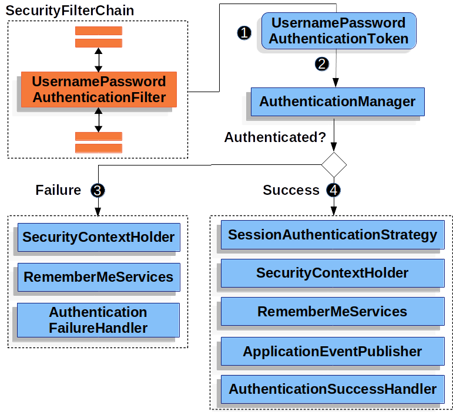

# 사용자 이름과 비밀번호 인증

사용자 이름과 비밀번호 검증은 사용자를 인증할 때 가장 많이 사용하는 방법 중 하나다. 그렇기 때문에 스프링 시큐리티는 이름과 비밀번호로 인증할 수 있는 방법을 종합적으로 지원한다.

> 이름/비밀번호 조회 메커니즘

스프링 시큐리티는 `HttpServletRequest` 에서 이름과 비밀번호를 읽을 수 있는 다음 메커니즘을 기본으로 제공한다:

- 폼 로그인
- 기본 인증
- 다이제스트 인증

> 저장 메커니즘

이름/비밀번호 조회 메커니즘은 지원하는 저장 메커니즘 중 어떤 것과도 조합할 수 있다:

- 인메모리 인증과 심플 스토리지
- JDBC 인증과 관계형 데이터베이스
- `UserDetailsService` 와 커스텀 데이터 스토어
- LDAP 인증과 LDAP 스토리지

## 폼 로그인

스프링 시큐리티는 HTML 폼 기반 사용자 이름/비밀번호 인증을 지원한다. 먼저 로그인 폼으로 리다이렉트하는 방법을 설명한다.


이전에 설명했던 `SecurityFilterChain` 다이어그램을 기반으로 그린 그림이다.

1. 먼저 사용자가 권한이 없는 리소스 `/private` 에 인증되지 않은 요청을 보낸다.
2. 스프링 시큐리티의 `FilterSecurityInterceptor` 에서 `AccessDeniedException` 을 던져 인증되지 않은 요청을 거절했음을 알린다.
3. 인증되지 않은 사용자이므로 `ExceptionTranslationFilter` 에서 인증을 시작하고, 설정한 `AuthenticationEntryPoint` 로 로그인 페이지로의 리다이렉트 응답을 전송한다. `AuthenticationEntryPoint` 는 대부분 `LoginUrlAuthenticationEntryPoint` 인스턴스다.
4. 그러면 브라우저는 리다이렉트된 로그인 페이지를 요청한다.
5. 애플리케이션에서는 로그인 페이지를 렌더링해야 한다.

username 과 password 를 제출하면 `UsernamePasswordAuthenticationFilter` 가 이 값을 인증한다. `UsernamePasswordAuthenticationFilter` 는 `AbstractAuthenticationProcessingFilter` 를 상속했기 때문에 다이어그램도 비슷하다.



이전에 설명했던 `SecurityFilterChain` 다이어그램을 기반으로 그린 그림이다.

1. 사용자가 이름과 비밀번호를 제출하면 `UsernamePasswordAuthenticationFilter` 는 `HttpServletRequest` 에서 이 값을 추출해 `Authentication` 유형 중 하나인 `UsernamePasswordAuthenticationToken` 을 만든다.
2. 그 다음엔 `UsernamePasswordAuthenticationToken` 을 `AuthenticationManager` 로 넘겨 인증한다. `AuthenticationManager` 상세 동작은 사용자 정보를 저장한 방식에 따라 다르다.
3. 인증에 실패하면
    - `SecurityContextHolder` 를 비운다.
    - `RememberMeServices.loginFail` 을 실행한다. remember me 를 설정하지 않았다면 아무 동작도 하지 않는다.
    - `AuthenticationFailureHandler` 를 실행한다.
4. 인증에 성공하면
    - `SessionAuthenticationStrategy` 에 새로 로그인했음을 통보한다.
    - `SecurityContextHolder` 에 `Authentication` 을 세팅한다.
    - `RememberMeServices.loginSuccess` 를 실행한다. remember me 를 설정하지 않았다면 아무 동작도 하지 않는다.
    - `ApplicationEventPublisher` 는 `InteractiveAuthenticationSuccessEvent` 를 발생시킨다.
    - `AuthenticationSuccessHandler` 를 실행한다. 보통 로그인 페이지로 리다이렉트할 때는 `SimpleUrlAuthenticationSuccessHandler` 가 `ExceptionTranslationFilter` 에 저장된 요청으로 리다이렉트한다.

스프링 시큐리티에선 폼 로그인이 디폴트로 활성화된다. 하지만 서블릿 기반 설정을 사용한다면 폼 기반 로그인을 명시해야 한다. 최소한 아래와 같은 설정이 있어야 한다:

```java
protected void configure(HttpSecurity http) {
    http
        // ...
        .formLogin(withDefaults());
}
```

```xml
<http>
    <!-- ... -->
    <form-login />
</http>
```

이 설정에선 디폴트 로그인 페이지로 렌더링한다. 프로덕션에서 사용할 앱플리케이션은 대부분 커스텀 로그인 폼이 필요하다.

```java
protected void configure(HttpSecurity http) throws Exception {
    http
        // ...
        .formLogin(form -> form
            .loginPage("/login")
            .permitAll()
        );
}
```

```xml
<http>
    <!-- ... -->
    <intercept-url pattern="/login" access="permitAll" />
    <form-login login-page="/login" />
</http>
```

스프링 시큐리티 설정에 로그인 페이지를 명시했다면 페이지 렌더링을 직접 구현해야 한다. 다음은 로그인 페이지 `/login` 에서 필요한 HTML 로그인 폼을 생성하는 타임리프 템플릿이다:

> src/main/resources/templates/login.html

```html
<!DOCTYPE html>
<html xmlns="http://www.w3.org/1999/xhtml" xmlns:th="https://www.thymeleaf.org">
    <head>
        <title>Please Log In</title>
    </head>
    <body>
        <h1>Please Log In</h1>
        <div th:if="${param.error}">
            Invalid username and password.</div>
        <div th:if="${param.logout}">
            You have been logged out.</div>
        <form th:action="@{/login}" method="post">
            <div>
            <input type="text" name="username" placeholder="Username"/>
            </div>
            <div>
            <input type="password" name="password" placeholder="Password"/>
            </div>
            <input type="submit" value="Login" />
        </form>
    </body>
</html>
```

디폴트 HTML 폼은 몇 가지 핵심 규칙을 따른다:

- `/login` 에 `post` 요청을 보내야 한다.
- CSRF 토큰을 포함해야 하며, 타임리프에서는 자동으로 추가된다.
- 사용자 이름은 `username` 파라미터로 명시해야 한다.
- 비밀번호는 `password` 파라미터로 명시해야 한다.
- HTTP 파라미터 error 가 있으면 사용자가 유효한 사용자 이름과 비밀번호를 제공하지 못했음을 나타낸다.
- HTTP 파라미터 logout 이 있으면 사용자가 로그아웃에 성공한 것을 나타낸다.

대부분은 로그인 페이지를 더 커스텀할 필요가 없을 것이다. 하지만 위에 있는 것 이상으로 더 커스텀하고 싶다면 추가 설정을 넣으면 된다. 스프링 MVC 를 사용한다면 `GET /login` 요청을 직접 만든 로그인 템플릿으로 매핑하는 컨트롤러가 필요하다. 다음 코드는 최소한으로 작성한 샘플 `LoginController` 다:

> src/main/java/example/LoginController.java

```java
@Controller
class LoginController {
    @GetMapping("/login")
    String login() {
        return "login";
    }
}
```

## 기본 인증

스프링 시큐리티에서 HTTP 기본 인증이 어떻게 동작하는지 살펴보자. 먼저 인증되지 않은 클라이언트에게 WWW-Authenticate 헤더를 다시 전송하는 것을 확인할 것이다.


1. 먼저 사용자가 권한이 없는 리소스 `/private` 에 인증되지 않은 요청을 보낸다.
2. 스프링 시큐리티의 `FilterSecurityInterceptor` 에서 `AccessDeniedException` 을 던져 인증되지 않은 요청을 거절했음을 알린다.
3. 인증되지 않은 사용자이므로 `ExceptionTranslationFilter` 에서 인증을 시작한다. 설정한 `AuthenticationEntryPoint` 는 `BasicAuthenticationEntryPoint` 인스턴스로, WWW-Authenticate 헤더를 전송한다. 이때는 클라이언트가 기존 요청을 다시 전송할 수 있으므로 `RequestCache` 는 보통 요청을 저장하지 않는 `NullRequestCache` 를 사용한다.

클라이언트는 WWW-Authenticate 헤더를 받으면 사용자 이름과 비밀번호로 재시도해야 한다는 것을 알고 있다. 다음은 사용자 이름과 비밀번호를 처리하는 플로우다:


1. 사용자가 사용자 이름과 비밀번호를 제출하면 `UsernamePasswordAuthenticationFilter` 는 `HttpServletRequest` 에서 이 값을 추출해 `Authentication` 유형 중 하나인 `UsernamePasswordAuthenticationToken` 을 만든다.
2. 그다음엔 `UsernamePasswordAuthenticationToken` 을 `AuthenticationManager` 로 넘겨 인증한다. `AuthenticationManager` 상세 동작은 사용자 정보를 저장한 방식에 따라 다르다.
3. 인증에 실패하면
    - `SecurityContextHolder` 를 비운다.
    - `RememberMeServices.loginFail` 을 실행한다. remember me를 설정하지 않았다면 아무 동작도 하지 않는다.
    - `AuthenticationEntryPoint` 를 실행해서 WWW-Authenticate 전송을 트리거한다.
4. 인증에 성공하면
    - `SecurityContextHolder` 에 `Authentication` 을 세팅한다.
    - `RememberMeServices.loginSuccess` 을 실행한다. remember me 를 설정하지 않았다면 아무 동작도 하지 않는다.
    - `BasicAuthenticationFilter` 에서 `FilterChain.doFilter(request,response)` 를 호출해서 나머지 어플리케이션 로직을 실행한다.

스프링 시큐리티에선 HTTP 기본 인증을 디폴트로 활성화한다. 하지만 서블릿 기반 설정을 하나라도 사용하고 있다면 HTTP Basic 을 명시해야 한다.

HTTP 기본 설정 예제

```java
protected void configure(HttpSecurity http) {
    http
        // ...
        .httpBasic(withDefaults());
}
```

```xml
<http>
    <!-- ... -->
    <http-basic />
</http>
```

## 다이제스트 인증

`DigestAuthenticationFilter` 가 제공하는 다이제스트 인증 지원 방식을 자세히 다룬다.

> 다이제스트 인증은 안전하지 않으므로 최신 애플리케이션에선 사용하지 말아야 한다. 비밀번호를 일반 텍스트나 암호화 형식 또는 MD5 형식으로 저장해야 한다는 게 가장 큰 문제다. 이 저장 형식은 전부 안전하지 않다. 그 대신 다이제스트에선 지원하지 않는, 단방향 적응형 비밀번호 해시 (i.e. bCrypt, PBKDF2, SCrypt 등)를 사용해서 자격증명을 저장해야 한다.

다이제스트 인증은 기본 인증의 많은 문제점을 개선하기 위한 시도였다. 특히 네트워크 상에서 자격증명을 일반 텍스트로 전달하지 않아도 된다. 많은 브라우저가 다이제스트 인증을 지원하고 있다.

HTTP 다이제스트 인증 관리 표준은 RFC2617 에 정의돼 있으며, RFC2069 에서 업데이트됐다. user agent 대부분은 RFC2617 을 구현하고 있다. 스프링 시큐리티가 지원하는 다이제스트 인증은 RFC2617 에서 규정한 “auth” quality of protection(`qop`) 과 호환되며, 이전 버전 RFC2069 와도 호환된다. 암호화하지 않은 HTTP (i.e. TLS/HTTPS 미적용) 통신에서 최대한 안전하게 인증을 처리하고 싶다면 다이제스트 인증이 더 매력적으로 느껴질 것이다. 하지만 HTTPS 는 무조건 적용하는 게 좋다.

다이제스트 인증의 핵심은 “nonce” 다. 서버에서 생성하는 값으로, 스프링 시큐리티의 nonce 는 다음 형식을 따른다:

```text
base64(expirationTime + ":" + md5Hex(expirationTime + ":" + key))
expirationTime:   밀리세컨드로 표현한 nonce의 만료 시각
key:              nonce 토큰 수정을 방지할 개인키
```

안전하지 않은 일반 텍스트 비밀번호를 저장할 땐 `NoOpPasswordEncoder` 를 사용하도록 설정했는지 확인해야 한다. 다음은 다이제스트 인증 설정 예시다:

다이제스트 인증 예제

```java
@Autowired
UserDetailsService userDetailsService;

DigestAuthenticationEntryPoint entryPoint() {
    DigestAuthenticationEntryPoint result = new DigestAuthenticationEntryPoint();
    result.setRealmName("My App Relam");
    result.setKey("3028472b-da34-4501-bfd8-a355c42bdf92");
}

DigestAuthenticationFilter digestAuthenticationFilter() {
    DigestAuthenticationFilter result = new DigestAuthenticationFilter();
    result.setUserDetailsService(userDetailsService);
    result.setAuthenticationEntryPoint(entryPoint());
}

protected void configure(HttpSecurity http) throws Exception {
    http
        // ...
        .exceptionHandling(e -> e.authenticationEntryPoint(authenticationEntryPoint()))
        .addFilterBefore(digestFilter());
}
```

```xml
<b:bean id="digestFilter"
        class="org.springframework.security.web.authentication.www.DigestAuthenticationFilter"
    p:userDetailsService-ref="jdbcDaoImpl"
    p:authenticationEntryPoint-ref="digestEntryPoint"
/>

<b:bean id="digestEntryPoint"
        class="org.springframework.security.web.authentication.www.DigestAuthenticationEntryPoint"
    p:realmName="My App Realm"
    p:key="3028472b-da34-4501-bfd8-a355c42bdf92"
/>

<http>
    <!-- ... -->
    <custom-filter ref="userFilter" position="DIGEST_AUTH_FILTER"/>
</http>
```

## In-Memory Authentication

스프링 시큐리티의 `InMemoryUserDetailsManager` 는 메모리 기반으로 username/password 를 인증하는 `UserDetailsService` 구현체다. `InMemoryUserDetailsManager` 는 `UserDetailsManager` 인터페이스도 구현했기 때문에 `UserDetails` 를 관리할 수 있다. username/password 를 읽어 인증하도록 설정하면 스프링 시큐리티는 `UserDetails` 를 통해 인증한다.

이 예제에선 스프링 부트 CLI 로 비밀번호 password 를 인코딩했으며, 인코딩된 값 `{bcrypt}$2a$10$GRLdNijSQMUvl/au9ofL.eDwmoohzzS7.rmNSJZ.0FxO/BTk76klW` 를 얻었다.

`InMemoryUserDetailsManager` 설정 예제

```java
@Bean
public UserDetailsService users() {
    UserDetails user = User.builder()
        .username("user")
        .password("{bcrypt}$2a$10$GRLdNijSQMUvl/au9ofL.eDwmoohzzS7.rmNSJZ.0FxO/BTk76klW")
        .roles("USER")
        .build();
    UserDetails admin = User.builder()
        .username("admin")
        .password("{bcrypt}$2a$10$GRLdNijSQMUvl/au9ofL.eDwmoohzzS7.rmNSJZ.0FxO/BTk76klW")
        .roles("USER", "ADMIN")
        .build();
    return new InMemoryUserDetailsManager(user, admin);
}
```

```xml
<user-service>
    <user name="user"
        password="{bcrypt}$2a$10$GRLdNijSQMUvl/au9ofL.eDwmoohzzS7.rmNSJZ.0FxO/BTk76klW"
        authorities="ROLE_USER" />
    <user name="admin"
        password="{bcrypt}$2a$10$GRLdNijSQMUvl/au9ofL.eDwmoohzzS7.rmNSJZ.0FxO/BTk76klW"
        authorities="ROLE_USER,ROLE_ADMIN" />
</user-service>
```

위 예제는 비밀번호를 안전한 포맷으로 저장하지만, 아직 아쉬운 점이 많다.

아래 예제는 `User.withDefaultPasswordEncoder` 로 메모리에 저장할 비밀번호를 보호한다. 하지만 소스 코드를 디컴파일하면 비밀번호를 쉽게 탈취할 수 있다. 따라서 `User.withDefaultPasswordEncoder` 는 스프링 시큐리티를 처음 접할 때만 사용해야 하며, 프로덕션 코드엔 사용하면 안 된다.

`InMemoryUserDetailsManager` 에서 `User.withDefaultPasswordEncoder` 를 사용한 예제

```java
@Bean
public UserDetailsService users() {
    // The builder will ensure the passwords are encoded before saving in memory
    UserBuilder users = User.withDefaultPasswordEncoder();
    UserDetails user = users
        .username("user")
        .password("password")
        .roles("USER")
        .build();
    UserDetails admin = users
        .username("admin")
        .password("password")
        .roles("USER", "ADMIN")
        .build();
    return new InMemoryUserDetailsManager(user, admin);
}
```

XML 기반으로는 간단하게 `User.withDefaultPasswordEncoder` 를 설정할 방법이 없다. 데모 프로젝트나 단순 연습용 코드라면 앞에 `{noop}` 을 프리픽스로 달아서 인코딩하지 않음을 지정하는 방법도 있다.

```xml
<user-service>
    <user name="user"
        password="{noop}password"
        authorities="ROLE_USER" />
    <user name="admin"
        password="{noop}password"
        authorities="ROLE_USER,ROLE_ADMIN" />
</user-service>
```

## JDBC 인증

스프링 시큐리티의 `JdbcDaoImpl` 은 JDBC 기반으로 username/password를 인증하는 `UserDetailsService` 구현체다. `JdbcDaoImpl` 을 상속한 `JdbcUserDetailsManager` 는 `UserDetailsManager` 인터페이스도 구현했기 때문에 `UserDetails` 를 관리할 수 있다. username/password 를 읽어 인증하도록 설정하면 스프링 시큐리티는 `UserDetails` 를 통해 인증한다.

다음 다룰 내용은 다음과 같다.

- 스프링 시큐리티 JDBC 인증에서 사용하는 디폴트 스키마
- 데이터 소스 설정
- `JdbcUserDetailsManager` 빈

### Default Schema

스프링 시큐리티는 JDBC 기반 인증을 위한 기본 쿼리를 제공한다. 여기에선 디폴트 쿼리에서 사용되는 디폴트 스키마를 다룬다. 쿼리나 데이터베이스 방언(dialect)을 커스텀한다면 스키마도 함께 바꿔야 한다.

User Schema

`JdbcDaoImpl` 에서 사용자의 비밀번호, 계정 상태 (활성화/비활성화), 권한 (roles) 리스트를 로드하려면 테이블이 있어야 한다. 필요한 디폴트 사용자 스키마는 다음과 같다:

> 디폴트 스키마는 클래스 패스 리소스 `org/springframework/security/core/userdetails/jdbc/users.ddl` 로도 접근할 수 있다.

```sql
create table users(
    username varchar_ignorecase(50) not null primary key,
    password varchar_ignorecase(50) not null,
    enabled boolean not null
);

create table authorities (
    username varchar_ignorecase(50) not null,
    authority varchar_ignorecase(50) not null,
    constraint fk_authorities_users foreign key(username) references users(username)
);
create unique index ix_auth_username on authorities (username,authority);
```

오라클도 많이 쓰는 데이터베이스 중 하나지만, 약간 다른 스키마가 필요하다. 오라클의 디폴트 사용자 스키마는 다음과 같다:

```sql
-- ORACLE DATABASES

CREATE TABLE USERS (
    USERNAME NVARCHAR2(128) PRIMARY KEY,
    PASSWORD NVARCHAR2(128) NOT NULL,
    ENABLED CHAR(1) CHECK (ENABLED IN ('Y','N') ) NOT NULL
);


CREATE TABLE AUTHORITIES (
    USERNAME NVARCHAR2(128) NOT NULL,
    AUTHORITY NVARCHAR2(128) NOT NULL
);
ALTER TABLE AUTHORITIES ADD CONSTRAINT AUTHORITIES_UNIQUE UNIQUE (USERNAME, AUTHORITY);
ALTER TABLE AUTHORITIES ADD CONSTRAINT AUTHORITIES_FK1 FOREIGN KEY (USERNAME) REFERENCES USERS (USERNAME) ENABLE;
```

그룹을 사용하는 어플리케이션은 그룹 스키마도 필요하다. 디폴트 그룹 스키마는 다음과 같다:

```sql
create table groups (
    id bigint generated by default as identity(start with 0) primary key,
    group_name varchar_ignorecase(50) not null
);

create table group_authorities (
    group_id bigint not null,
    authority varchar(50) not null,
    constraint fk_group_authorities_group foreign key(group_id) references groups(id)
);

create table group_members (
    id bigint generated by default as identity(start with 0) primary key,
    username varchar(50) not null,
    group_id bigint not null,
    constraint fk_group_members_group foreign key(group_id) references groups(id)
);
```

### DataSource

`JdbcUserDetailsManager` 를 설정하려면 먼저 `DataSource` 가 있어야 한다. 이 예제에서는 디폴트 사용자 스키마로 초기화하는 임베디드 데이터소스를 설정한다.

```java
@Bean
DataSource dataSource() {
    return new EmbeddedDatabaseBuilder()
        .setType(H2)
        .addScript("classpath:org/springframework/security/core/userdetails/jdbc/users.ddl")
        .build();
}
```

```xml
<jdbc:embedded-database>
    <jdbc:script location="classpath:org/springframework/security/core/userdetails/jdbc/users.ddl"/>
</jdbc:embedded-database>
```

### JdbcUserDetailsManager

이 예제에선 스프링 부트 CLI 로 비밀번호 `password` 를 인코딩했으며, 인코딩된 값 `{bcrypt}$2a$10$GRLdNijSQMUvl/au9ofL.eDwmoohzzS7.rmNSJZ.0FxO/BTk76klW` 를 얻었다. 비밀번호를 저장하는 방법은 `PasswordEncoder` 섹션을 참고하라.

```java
@Bean
UserDetailsManager users(DataSource dataSource) {
    UserDetails user = User.builder()
        .username("user")
        .password("{bcrypt}$2a$10$GRLdNijSQMUvl/au9ofL.eDwmoohzzS7.rmNSJZ.0FxO/BTk76klW")
        .roles("USER")
        .build();
    UserDetails admin = User.builder()
        .username("admin")
        .password("{bcrypt}$2a$10$GRLdNijSQMUvl/au9ofL.eDwmoohzzS7.rmNSJZ.0FxO/BTk76klW")
        .roles("USER", "ADMIN")
        .build();
    JdbcUserDetailsManager users = new JdbcUserDetailsManager(dataSource);
    users.createUser(user);
    users.createUser(admin);
    return users;
}
```

```xml
<jdbc-user-service>
    <user name="user"
        password="{bcrypt}$2a$10$GRLdNijSQMUvl/au9ofL.eDwmoohzzS7.rmNSJZ.0FxO/BTk76klW"
        authorities="ROLE_USER" />
    <user name="admin"
        password="{bcrypt}$2a$10$GRLdNijSQMUvl/au9ofL.eDwmoohzzS7.rmNSJZ.0FxO/BTk76klW"
        authorities="ROLE_USER,ROLE_ADMIN" />
</jdbc-user-service>
```

## UserDetails

`UserDetails` 는 `UserDetailsService` 가 리턴하는 값이다. `DaoAuthenticationProvider` 가 `UserDetails` 를 인증하고, 이 `UserDetails` 를 `principal` 로 가진 `Authentication` 을 리턴한다.

## UserDetailsService

`UserDetailsService` 는 `DaoAuthenticationProvider` 가 사용자 이름과 비밀번호로 인증할 때 필요한 사용자 이름과 비밀번호를 다른 속성을 조회할 때 사용한다. 스프링 시큐리티가 제공하는 `UserDetailsService` 는 인메모리와 JDBC 기반 구현체가 있다.

커스텀 인증을 정의하려면 커스텀 `UserDetailsService` 를 빈으로 만들면 된다. `AuthenticationManagerBuilder` 를 사용하지 않고 `AuthenticationProviderBean` 빈도 정의하지 않았을 때 사용하는 방법이다.

```java
@Bean
CustomUserDetailsService customUserDetailsService() {
    return new CustomUserDetailsService();
}
```

```xml
<b:bean class="example.CustomUserDetailsService"/>
```

## PasswordEncoder

서블릿에서 스프링 시큐리티를 사용하면 `PasswordEncoder` 를 통합해 비밀번호를 안전하게 저장할 수 있다. 스프링 시큐리티가 사용하는 `PasswordEncoder` 구현체를 커스텀하려면 `PasswordEncoder` 빈을 정의하면 된다.

## DaoAuthenticationProvider

`DaoAuthenticationProvider` 는 `UserDetailsService` 와 `PasswordEncoder` 로 사용자 이름과 비밀번호를 인증하는 `AuthenticationProvider` 구현체다.

스프링 시큐리티에서 `DaoAuthenticationProvider` 가 동작하는 방식을 살펴보자.


1. 사용자 이름과 비밀번호를 조회하는 인증 `Filter` 에서 `UsernamePasswordAuthenticationToken` 을 `AuthenticationManager` 로 넘긴다. `AuthenticationManager` 는 `ProviderManager` 가 구현하고 있다.
2. 이 `ProviderManager` 는 `DaoAuthenticationProvider` 를 `AuthenticationProvider` 로 사용하도록 설정돼 있다.
3. `DaoAuthenticationProvider` 는 `UserDetailsService` 에서 `UserDetails` 를 조회한다.
4. 그다음 `DaoAuthenticationProvider` 는 이전 단계에서 얻은 `UserDetails` 에 있는 비밀번호를 `PasswordEncoder` 로 검증한다.
5. 인증에 성공하면 `UsernamePasswordAuthenticationToken` 타입의 `Authentication` 을 반환하며, 이 객체는 `UserDetailsService` 가 리턴한 `UserDetails` 를 principal 로 가지고 있다. 결국에 리턴한 `UsernamePasswordAuthenticationToken` 은 인증 `Filter` 에서 `SecurityContextHolder` 로 세팅된다.

## LDAP Authentication

생략
