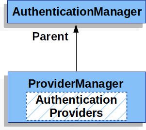
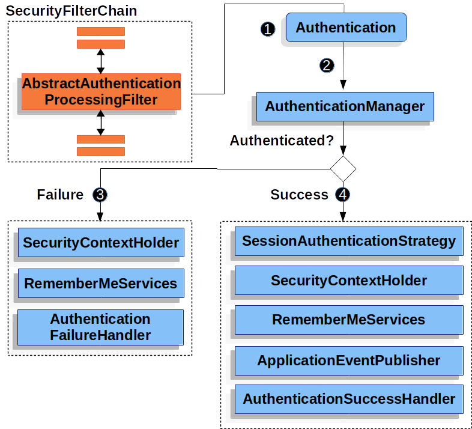

# Authentication

서블릿 인증간 사용하는 주요 **아키텍쳐 컴포넌트**는 다음과 같다.

| 객체 | 설명 |
| --- | --- |
| `SecurityContextHolder` | 스프링 시큐리티에서 인증한 대상에 대한 상세 정보는 `SecurityContextHolder` 에 저장한다. |
| `SecurityContext` | `SecurityContextHolder` 로 접근할 수 있으며, 현재 인증한 사용자의  `Authentication` 을 가지고 있다. |
| `Authentication` | 사용자가 제공한 인증용 자격증명(credential)이나 `SecurityContext` 에 있는 현재 사용자의 자격증명을 제공하며, `AuthenticationManager` 의 입력으로 사용한다. |
| `GrantedAuthority` | `Authentication` 에서 접근 주체(principal)에 부여한 권한 (i.e. role, scope 등.) |
| `AuthenticationManager` | 스프링 시큐리티의 필터가 인증을 어떻게 수행할지를 정의하는 API. |
| `ProviderManager` | 가장 많이 사용하는 `AuthenticationManager` 구현체. |
| `AuthenticationProvider` | `ProviderManager` 가 특정 인증 유형을 수행할 때 사용한다. |
| `AuthenticationEntryPoint` | 클라이언트에 자격증명을 요청할 때 사용한다. (i.e. 로그인 페이지로 리다이렉트하거나 `WWW-Authenticate` 헤더를 전송하는 등) |
| `AbstractAuthenticationProcessingFilter` | 인증에 사용할 `Filter` 의 베이스. 필터를 잘 이해하면 여러 컴포넌트를 조합해서 심도 있는 인증 플로우를 구성할 수 있다. |

## SecurityContextHolder

> **스프링 시큐리티의 인증의 중심에는 `SecurityContextHolder` 가 있다.**


`SecurityContextHolder` 에는 `SecurityContext` 가 있으며 `SecurityContextHolder` 에는 인증한 사용자의 상세 정보를 어떻게 값을 넣는지는 신경쓰지 않으며 **값이 있다면 인증한 사용자 정보**로 사용한다.

```java
SecurityContext context = SecurityContextHolder.createEmptyContext(); // (1)
Authentication authentication = new TestingAuthenticationToken("username", "password", "ROLE_USER"); // (2)
context.setAuthentication(authentication);

SecurityContextHolder.setContext(context); // (3)
```

1. 비어 있는 `SecurityContext` 를 생성한다.
    - 스레드 경합을 피하려면 `SecurityContextHolder.getContext().setAuthentication(authentication)` 을 사용해선 안되며, 새 `SecurityContext` 인스턴스를 생성해야 한다.
2. 새 `Authentication` 객체를 생성한다.
    - `Authentication` 의 구현체라면 모두 `SecurityContext` 에 담을 수 있다. 
    - 프로덕션에서는 `UsernamePasswordAuthenticationToken(userDetails, password, authorities)` 를 주로 사용한다.
3. 마지막으로 `SecurityContextHolder` 에 `SecurityContext` 를 설정한다. 이 정보를 사용하여 스프링 시큐리티는 권한을 인가한다.

> **인증된 주체의 정보(principal)를 얻어야 한다면 `SecurityContextHolder` 에 접근하면 된다.**

```java
SecurityContext context = SecurityContextHolder.getContext();
Authentication authentication = context.getAuthentication();
String username = authentication.getName();
Object principal = authentication.getPrincipal();
Collection<? extends GrantedAuthority> authorities = authentication.getAuthorities();
```

`SecurityContextHolder` 는 기본적으로 `ThreadLocal` 을 사용하여 정보를 저장하기 때문에 메소드에 직접 `SecurityContext` 를 넘기지 않아도 동일한 스레드라면 항상 `SecurityContext` 에 접근 할 수 있다. 이전 principal 요청을 처리한 후에 비워주는 것만 잊지 않는다면 `ThreadLocal` 을 사용해도 안전한 방법이다.

`FilterChainProxy` 는 항상 `SecurityContext` 를 비워서 준다.

애플리케이션의 스레드 처리 방법에 따라서 `ThreadLocal` 이 적합하지 않은 경우도 있는데, 이 경우에는 기동 시점에서 사용할 컨텍스트 저장 전략을 설정할 수 있다. standalone 애플리케이션에서는 `SecurityContextHolder.MODE_GLOBAL` 전략을 적용할수 있다. 인증 처리를 마친 스레드가 다른 스레드에서도 그대로 사용해야 하는 애플리케이션이라면 `SecurityContextHolder.MODE_INHERITABLETHREADLOCAL` 전략을 적용할 수 있다. 기본 전략은 `SecurityContextHolder.MODE_THREADLOCAL` 이며 전략을 바꾸는 방법은 크게 2가지이다.

- 프로퍼티 설정을 통한 컨텍스트 저장 전략 변경
- `SecurityContextHolder` 에 있는 정적 메소드를 사용하는 저장 전력 변경

대부분의 상황에서는 기본 전략으로 충분하지만 바꿔야 한다면 `SecurityContextHolder` 의 도큐먼트를 참조하길 권장한다.

## SecurityContext

`SecurityContext` 는 `SecurityContextHolder` 로 접근할 수 있다. `SecurityContext` 는 `Authentication` 객체를 가지고 있다.

## Authentication (객체)

- `AuthenticationManager` 의 입력으로 사용되어 인증에 사용할 사용자의 자격증명을 제공한다. 이 상황에선 `isAuthenticated()` 는 false 를 반환한다.
- 현재 인증된 사용자를 나타낸다. 현재 `Authentication` 은 `SecurityContext` 에서 가져올 수 있다.

| `Authentication` 정보 | 설명 |
| --- | --- |
| principal | 사용자를 식별한다. 사용자 이름/비밀번호로 인증할 땐 보통 UserDetails 인스턴스다. |
| credentials | 주로 비밀번호. 대부분은 유출되지 않도록 사용자를 인증한 다음 비운다. |
| authorities | 사용자에게 부여한 권한은 GrantedAuthority로 추상화한다. 예시로 role이나 scope가 있다. |

## GrantedAuthority

사용자에게 부여한 권한은 `GrantedAuthority` 로 추상화한다. (예로는 role 이나 scope 가 있다.)

`GrantedAuthority` 는 `Authentication.getAuthorities()` 메소드로 접근할 수 있다. 이 메소드는 `GrantedAuthority` 객체의 `Collection` 을 반환하며 `GrantedAuthority` 는 말 그대로 인증한 주체(principal)에게 부여된 권한을 의미한다. 권한은 보통 `ROLE_ADMINISTRATOR` 나 `ROLE_HR_SUPERVISOR` 같은 역할 (role)이다. 이런 역할은 이후에 웹 인가, 메소드 인가, 도메인 객체 인가에서 사용한다. 스프링 시큐리티의 다른 코드에선 role 을 해석하고 필요한 권한을 확인한다. 이름/비밀번호 기반 인증을 사용한다면 보통 `UserDetailsService` 가 `GrantedAuthority` 를 로드한다.

`GrantedAuthority` 객체는 일반적으로 어플리케이션 전체에 걸친 권한을 의미한다. 특정 도메인 객체에 국한되지 않아 `Employee` 객체 번호 54 의 권한을 나타내는 `GrantedAuthority`, 이런 식으로는 잘 쓰지 않는다. 이렇게 사용하면 권한을 수천 개 만들게 될 수도 있고 메모리가 부족해지기 십상이다. (그렇지 않더라도 최소한 사용자를 인증하는 시간이 길어진다.) 물론, 스프링 시큐리티는 이런 일반적인 요구사항을 처리하도록 설계하였지만 원한다면 도메인 객체 단위로도 보안을 적용할 수 있다.

## AuthenticationManager

`AuthenticationManager` 는 스프링 시큐리티 필터의 인증 수행 방식을 정의하는 API 다.

매니저가 반환한 `Authentication` 을 `SecurityContextHolder` 에 설정하는 건 `AuthenticationManager` 를 호출한 객체 (i.e. 스프링 시큐리티의 필터)가 담당한다. 스프링 시큐리티의 `Filter` 들을 사용하지 않는다면 `AuthenticationManager` 를 사용할 필요 없이 직접 `SecurityContextHolder` 를 설정하면 된다.

`AuthenticationManager` 구현체는 어떤 것을 사용해도 좋지만 가장 많이 사용하는 구현체는 `ProviderManager` 다.

## ProviderManager

`ProviderManager` 는 가장 많이 쓰는 `AuthenticationManager` 구현체다. `ProviderManager` 는 동작을 `AuthenticationProvider` `List` 에 위임한다. 모든 `AuthenticationProvider` 는 인증을 성공시키거나, 실패시키거나, 아니면 결정을 내릴 수 없는 것으로 판단하고 다운스트림에 있는 `AuthenticationProvider` 가 결정하도록 만들 수 있다. 설정해둔 `AuthenticationProvider` 가 전부 인증하지 못하면 `ProviderNotFoundException` 과 함께 실패한다. 이 예외는 `AuthenticationException` 의 하위클래스로, 넘겨진 `Authentication` 유형을 지원하는 `ProviderManager` 를 설정하지 않았음을 의미한다.


보통은 `AuthenticationProvider` 마다 각자가 맡은 인증을 수행하는 법을 알고 있다. 예를 들어 `AuthenticationProvider` 하나로 이름/비밀번호를 검증할 수 있고, 다른 하나는 SAML 인증을 담당할 수 있다. 이렇게 하면 인증 유형마다 담당 `AuthenticationProvider` 가 있기 때문에, `AuthenticationManager` 빈 하나만 외부로 노출하면서도 여러 인증 유형을 지원할 수 있다.

원한다면 `ProviderManager` 에 인증을 수행할 수 있는 `AuthenticationProvider` 가 없을 때 사용할, 부모 `AuthenticationManager` 를 설정할 수도 있다. 부모는 `AuthenticationManager` 의 어떤 구현체도 될 수 있지만 보통 `ProviderManager`  인스턴스를 많이 사용한다.



사실은 여러 `ProviderManager` 인스턴스에 동일한 부모 `AuthenticationManager` 를 공유하는 것도 가능하다. 각각 인증 메커니즘이 다른 (`ProviderManager` 인스턴스가 다른) `SecurityFilterChain` 여러 개가 공통 인증을 사용하는 경우에 (부모 `AuthenticationManager` 를 공유) 흔히 쓰는 패턴이다.


기본적으로 `ProviderManager` 는 인증에 성공하면 반환받은 `Authentication` 객체에 있는 모든 민감한 자격증명 정보를 지운다. 이로써 비밀번호 같은 정보를 `HttpSession` 에 필요 이상으로 길게 유지하지 않는 것이다. 하지만 상태가 없는 어플리케이션에서 성능 향상 등을 위해 사용자 객체를 캐시한다면 문제가 될 수 있다.

`Authentication` 이 캐시 안에 있는 객체를 참조하고 있는데 (`UserDetails` 인스턴스 등) 자격증명을 제거한다면, 캐시된 값으로는 더 이상 인증할 수 없다.

**캐시를 사용한다면 이 점을 반드시 고려해야 한다.**

캐시 구현부나 `Authentication` 객체를 생성하는 `AuthenticationProvider` 에서 객체의 복사본을 만들면 명쾌하게 해결된다. 아니면 `ProviderManager`의 `eraseCredentialsAfterAuthentication` 프로퍼티를 비활성화시켜도 된다. 자세한 정보는 Javadoc을 참고하라.

## AuthenticationProvider

`ProviderManager` 에는 `AuthenticationProvider` 를 여러개 주입할 수 있다. `AuthenticationProvider` 마다 담당하는 인증 유형이 다르다. 예를 들어 `DaoAuthenticationProvider` 는 이름/비밀번호 기반 인증을, `JwtAuthenticationProvider` 는 JWT 토큰 인증을 지원한다.

## Request Credentials with AuthenticationEntryPoint

`AuthenticationEntryPoint` 는 클라이언트의 자격증명을 요청하는 HTTP 응답을 보낼 때 사용한다.

클라이언트가 리소스를 요청할 때 미리 이름/비밀번호 같은 자격증명을 함께 보낼 때도 있다. 이 경우 자격증명을 요청하는 HTTP 응답을 만들 필요가 없어진다.

하지만 클라이언트가 접근 권한이 없는 리소스에 인증되지 않은 요청을 보내기도 한다. 이 경우 `AuthenticationEntryPoint` 구현체가 클라이언트의 자격증명을 요청한다.

`AuthenticationEntryPoint` 는 로그인페이지로 리다이렉트 하거나, WWW-Authenticate 헤더로 응답하는 등의 일을 담당한다.

## AbstractAuthenticationProcessingFilter

`AbstractAuthenticationProcessingFilter` 는 사용자의 자격증명을 인증하기 위한 기본 `Filter` 다. 자격증명을 인증할 수 없다면, 스프링 시큐리티는 보통 `AuthenticationEntryPoint` 로 자격증명을 요청한다.

이후 `AbstractAuthenticationProcessingFilter` 는 제출한 모든 인증 요청을 처리할 수 있다.



1. 사용자가 자격증명을 제출하면 `AbstractAuthenticationProcessingFilter` 는 인증할 `HttpServletRequest` 로부터 `Authentication` 을 만든다. 생성하는 `Authentication` 타입은 `AbstractAuthenticationProcessingFilter` 하위 클래스에 따라 다르다. 예를 들어 `UsernamePasswordAuthenticationFilter` 는 `HttpServletRequest` 에 있는 *username* 과 *password* 로 `UsernamePasswordAuthenticationToken` 을 생성한다.
2. 그 다음엔 `Authentication` 을 `AuthenticationManager` 로 넘겨서 인증한다.
3. 인증에 실패하면
    - `SecurityContextHolder` 를 비운다.
    - `RememberMeServices.loginFail` 을 실행한다. remember me 를 설정하지 않았다면 아무 동작도 하지 않는다.
    - `AuthenticationFailureHandler` 를 실행한다.
4. 인증에 성공하면
    - `SessionAuthenticationStrategy` 에 새로 로그인했음을 통보한다.
    - `SecurityContextHolder` 에 `Authentication` 을 세팅한다. 이후 `SecurityContextPersistenceFilter` 가 `HttpSession` 에 `SecurityContext` 를 저장한다.
    - `RememberMeServices.loginSuccess` 를 실행한다. remember me 를 설정하지 않았다면 아무 동작도 하지 않는다.
    - `ApplicationEventPublisher` 는 `InteractiveAuthenticationSuccessEvent` 를 발생시킨다.
