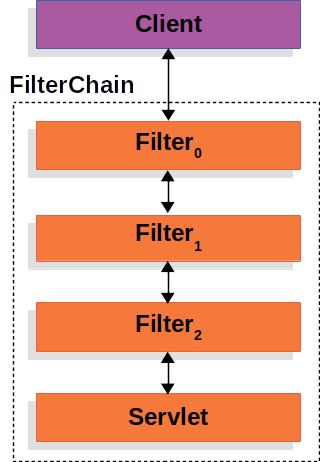

# Servlet Security

원글 출처 : [Spring security](https://docs.spring.io/spring-security/site/docs/5.3.2.RELEASE/reference/html5/)

번역 출처 : [토리맘의 한글라이즈 프로젝트](https://godekdls.github.io/Spring%20Security/contents/)

| 객체 | 역할 |
| --- | --- |
| `DelegatingFilterProxy` | 서블릿 컨테이너의 라이프사이클과 스프링의 `ApplicationContext` 와의 연결 |
| `FilterChainProxy` | 1. 서블릿을 지원하는 역할 <br/> 2. `SecurityFilterChain` 를 통해 여러 `Filter` 인스턴스로 위임 <br/> 3. `DelegatingFilterProxy` 로 감싸져 있음 |
| `SecurityFilterChain` | `Filter` 의 묶음 단위 |

## Filter

시큐리티는 서블릿 `Filter` 를 기반으로 서블릿을 지원하므로 `Filter` 의 역할을 알고가면 이해하기 쉬울것이다.



위 이미지는 단일 HTTP 요청을 처리하는 전형적인 레이어이다.

클라이언트는 애플리케이션으로 요청을 전송하고 `Servlet` 과 여러 `Filter` 로 구성된 `FilterChain` 을 만들어 URI path 기반으로 `HttpServletRequest` 를 처리한다. (스프링 MVC 에서의 `Servlet` 은 `DispatherServlet` 이다.)

단일 `HttpServletRequest` 와 `HttpServletResponse` 처리는 최대 한 개의 `Servlet` 이 담당하지만 `Filter` 는 여러 개를 사용할 수 있다.

- 다운스트림의 `Servlet` 과 여러 `Filter` 의 실행을 막는다. (이 경우엔 보통 `Filter` 에서 `HttpServletResponse` 를 작성한다.)
- 다운스트림에 있는 `Servlet` 과 여러 `Filter` 로 `HttpServletRequest` 나 `HttpServletResponse` 를 수정한다.

`Filter` 는 `FilterChain` 안에 있을때 효력을 발휘하며 다운스트림에 있는 나머지 `Filter` 와 `Servlet` 에 영향을 주기 때문에 `Filter` 의 실행 순서는 **매우 중요**하다.

## DelegatingFilterProxy

`DelegatingFilterProxy` 는 `Filter` 구현체로 서블릿 컨테이너의 라이프사이클과 스프링의 `ApplicationContext` 를 연결한다.

> 서블릿 컨테이너의 라이프사이클 ← `DelegatingFilterProxy` → 스프링 `ApplicationContext`

서블릿 컨테이너는 자체적인 표준을 사용해 `Filter` 를 등록할 수 있지만, 스프링이 정의하는 빈은 인식하지 못한다.

`DelegatingFilterProxy` 는 표준 서블릿 컨테이너 메커니즘으로 등록할 수 있으면서 모든 처리를 `Filter` 를 구현한 스프링 빈으로 위임해준다.


`DelegatingFilterProxy` 는 `ApplicationContext` 에서 *BeanFilter 0* 를 찾아 실행한다.

```java
public void doFilter(ServletRequest request, ServletResponse response, FilterChain chain) {
    // Lazily get Filter that was registered as a Spring Bean
    // For the example in DelegatingFilterProxy delegate is an instance of Bean Filter0
    Filter delegate = getFilterBean(someBeanName);
    // delegate work to the Spring Bean
    delegate.doFilter(request, response);
}
```

`DelegatingFilterProxy` 를 사용하면 `Filter` 빈 인스턴스 참조를 지연시킬 수도 있다.

컨테이너는 기동하기 전 `Filter` 를 등록해야하기 때문에 중요한 기능이다.

스프링은 보통 `Filter` 인스턴스들을 등록하는 시점 이후에 필요한 스프링 빈을 `ContextLoaderListener` 로 가져온다.

## FilterChainProxy


시큐리티는 `FilterChainProxy` 로 서블릿을 지원한다.

`FilterChainProxy` 는 시큐리티가 제공하는 `Filter` 로 `SecurityFilterChain` 을 통해 여러 `Filter` 인스턴스로 위임할 수 있다.

`FilterChainProxy` 는 빈이기 때문에 보통 `DelegatingFilterProxy` 로 감싸져 있다.

## SecurityFilterChain


`FilterChainProxy` 가 요청에 사용할 스프링 시큐리티의 `Filter` 들을 선택할 때 `SecurityFilterChain` 을 사용한다.

`SecurityFilterChain` 에 있는 보안 필터들은 전형적인 빈이지만 `DelegatingFilterProxy` 가 아닌 `FilterChainProxy` 로 등록한다.

`FilterChainProxy` 를 직접 서블릿 컨테이너에 등록하거나 `DelegatingFilterProxy` 에 등록하면 좋은 점이 있다.

먼저 시큐리티가 서블릿을 지원할 수 있는 시작점이 되어준다.

따라서 서블릿에 스프링 시큐리티를 적용하다 문제를 겪는다면 `FilterChainProxy` 부터 **디버그 포인트를 추가**해보는 것이 좋다.

`FilterChainProxy` 는 시큐리티의 중심점이기 때문에 필수로 여겨지는 작업을 수행할 수 있다는 장점이 있다.

예를 들어 `SecurityContext` 를 비워 메모리 누수를 방지할 수 있다.

`HttpFireWall` 을 적용하여 특정 공격 유형을 방어할 수도 있다.

더하여 `SecurityFilterChain` 을 언제 실행해야 할지도 유연하게 결정할 수 있다.

서블릿 컨테이너에서는 URL 로만 실행할 `Filter` 들을 결정한다.

하지만 `FilterChainProxy` 는 `RequestMather` 인터페이스를 사용하면 `HttpServletRequest` 에 있는 어떤 것으로도 실행 여부를 결정할 수 있다.

`SecurityFilterChain` 자체를 결정하는 것도 `FilterChainProxy` 를 사용하는데 애플리케이션에선 완전히 설정을 분리하여 여러 *슬라이스*를 구성할 수 있다.


위 이미지에는 `SecurityFilterChain` 이 여러 개 있다.

어떤 `SecurityFilterChain` 을 사용할지는 `FilterChainProxy` 가 결정한다.

가장 먼저 매칭된 `SecurityFilterChain` 을 실행한다.

`/api/**` 로 요청하면 해당 패턴으로 먼저 매칭되므로 `SecurityFilterChain` **0** 만 실행하며 `SecurityFilterChain` **N** 을 실행하지 않는다.

`/message/**` 로 요청하면 `SecurityFilterChain` **N** 을 실행한다.

각 `SecurityFilterChain` 에 구성된 `Filter` 는 각각 3 개, 4 개이다.

즉 고유한 격리된 설정을 가질 수 있는 것이며, 애플리케이션의 특정 요청은 시큐리티가 무시하길 바란다면 `SecurityFilterChain` 에 보안 `Filter` 를 0 개 설정하는 것도 가능하다.

## Security Filters

`SecurityFilterChain` 를 사용하여 `FilterChainProxy` 에 추가한다.

이 경우에는 `Filter` 의 순서가 중요하다.

일반적으로 시큐리티의 순서를 알 필요가 없지만 나열해보면 다음과 같다.

- `ChannelProcessingFilter`
- `ConcurrentSessionFilter`
- `WebAsyncManagerIntegrationFilter`
- `SecurityContextPersistenceFilter`
- `HeaderWriterFilter`
- `CorsFilter`
- `CsrfFilter`
- `LogoutFilter`
- `OAuth2AuthorizationRequestRedirectFilter`
- `Saml2WebSsoAuthenticationRequestFilter`
- `X509AuthenticationFilter`
- `AbstractPreAuthenticatedProcessingFilter`
- `CasAuthenticationFilter`
- `OAuth2LoginAuthenticationFilter`
- `Saml2WebSsoAuthenticationFilter`
- `UsernamePasswordAuthenticationFilter`
- `ConcurrentSessionFilter`
- `OpenIDAuthenticationFilter`
- `DefaultLoginPageGeneratingFilter`
- `DefaultLogoutPageGeneratingFilter`
- `DigestAuthenticationFilter`
- `BearerTokenAuthenticationFilter`
- `BasicAuthenticationFilter`
- `RequestCacheAwareFilter`
- `SecurityContextHolderAwareRequestFilter`
- `JaasApiIntegrationFilter`
- `RememberMeAuthenticationFilter`
- `AnonymousAuthenticationFilter`
- `OAuth2AuthorizationCodeGrantFilter`
- `SessionManagementFilter`
- `ExceptionTranslationFilter`
- `FilterSecurityInterceptor`
- `SwitchUserFilter`

## Handling Security Exceptions

`ExceptionTranslationFilter` 는 `AccessDeniedException` 을 해석하고 `AuthenticationException` 을 HTTP 응답으로 바꾸어준다.

`ExceptionTranslationFilter` 는 `FilterChainProxy` 에 하나의 보안 필터로 추가된다.


1. 우선 `ExceptionTranslationFilter` 는 `FilterChain.doFilter(request, response)` 를 호출해 애플리케이션의 나머지 로직을 실행한다.
2. 인증되지 않은 사용자거나 `AuthenticationException` 이 발생하였다면, **인증을 시작한다.**
   - SecurityContextHolder 를 비운다.
   - `ReqeustCache` 에 `HttpServletRequest` 를 저장한다. 인증에 성공하면 `ReqeustCache` 로 기존 요청처리를 이어간다.
   - `AuthenticationEntryPoint` 는 클라이언트에 credential 을 요청할 때 사용한다. (로그인 페이지로 리다이렉트하거나 `WWW-Autenticate` 헤더를 전송한다.)
3. `AccessDeniedException` 이었다면 **접근을 거부한다.** 거절된 요청은 `AccessDeniedHandler` 에서 처리한다.

> 애플리케이션에서 `AccessDeniedException` 또는 `AuthenticationException` 을 던지지 않으면 `ExceptionTranslationFilter` 는 **아무 일도 하지 않는다.**

### pseudocode

```java
try {
    filterChain.doFilter(request, response); // (1)
} catch (AccessDeniedException | AuthenticationException e) {
    if ( !authenticated || e instanceof AuthenticationException) {
        startAuthentication(); // (2)
    } else {
        accessDenied(); // (3)
    }
}
```

1. `FilterChain.doFilter(request, response)` 를 호출해서 애플리케이션의 나머지 작업을 이어 처리한다. 즉 애플리케이션에 있는 다른 코드에서 ( `FilterSecurityInterceptor` 또는 메소드 시큐리티 ) `AuthenticationException` 이나 `AccessDeniedException` 이 발생하면 예외를 받아 처리한다.
2. 인증 받지 않은 사용자이거나 `AuthenticationException` 이 발생하였다면 **인증을 시작한다.**
3. 그렇지 않다면 **접근을 거부한다.**
